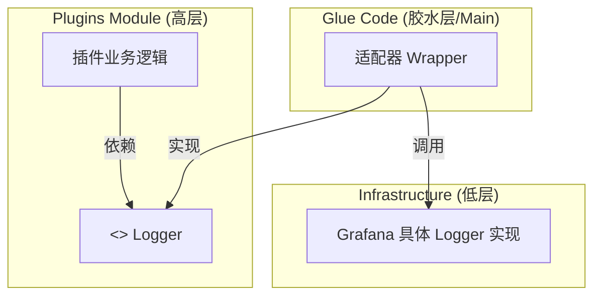

# 学习笔记：依赖倒置与解耦设计模式 (以 Grafana 日志为例)

> **核心思想**：高层模块不应该依赖低层模块，两者都应该依赖其抽象。

在 Grafana 的代码库中，`pkg/plugins`（插件模块）与 `pkg/infra/log`（基础设施日志）之间的关系，是一个教科书级别的 **依赖倒置原则 (Dependency Inversion Principle, DIP)** 和 **适配器模式 (Adapter Pattern)** 的实战案例。

## 1. 问题背景

我们需要实现插件功能（`pkg/plugins`），插件需要打印日志。
但是，插件是一个独立的模块，我们**不希望**它直接依赖 Grafana 庞大的核心基础设施（`pkg/infra/log`）。

如果直接引用 (`plugins` -> `infra/log`)，会导致：
*   **强耦合**：插件无法独立拆分或复用。
*   **循环依赖风险**：如果 `infra` 未来引用了 `plugins` 的类型，整个项目会编译报错。
*   **测试困难**：测插件逻辑时，被迫初始化复杂的全局日志系统。

## 2. 解决方案：引入中间抽象层

Grafana 通过引入一个“中间人” —— **接口层**，打断了直接依赖。

### 架构图解



### 关键代码结构

#### A. 抽象层 (定义需求)
位置：`pkg/plugins/log/ifaces.go`
**解释**：插件模块大声喊出：“我需要一个能打印日志的东西，长这样就行，通过 factory 给我就行！” 它完全不知道 Grafana 的存在。

```go
package log

// 1. 定义接口 (Interface)
type Logger interface {
    Info(msg string, args ...interface{})
    Error(msg string, args ...interface{})
}

// 2. 提供注入点 (Injection Point)
var factory func(name string) Logger

func SetLoggerFactory(f func(name string) Logger) {
    factory = f
}
```

#### B. 实现层 (提供能力)
位置：`pkg/infra/log/*.go`
**解释**：这是 Grafana 核心的日志实现，功能强大，支持文件轮转、配置解析等。但它不知道插件的存在。

```go
package log // infra/log

type ConcreteLogger struct { ... }
func (l *ConcreteLogger) Info(...) { ... }
```

#### C. 胶水层 (依赖注入)
位置：`pkg/services/pluginsintegration/pluginslog/pluginslog.go`
**解释**：在程序启动时，把 B 包装成 A 想要的样子，塞给 A。

```go
func init() {
    // 依赖注入 (Dependency Injection)
    pluginslog.SetLoggerFactory(func(name string) pluginslog.Logger {
        // 创建适配器 (Adapter)
        // 把 infra.Logger 包装成 plugins.Logger
        return &grafanaInfraLogWrapper{
            l: infra_log.New(name),
        }
    })
}
```

## 3. 设计模式总结

这个案例通过组合三种模式达到了完美的解耦：

1.  **依赖倒置 (DIP)**：
    *   *Before*: Plugins 依赖 Infra。
    *   *After*: Plugins 依赖 Interface，Infra (通过胶水层) 也依赖 Interface。
    *   **结果**：依赖箭头反转了，Plugins 变得独立、纯净。

2.  **适配器模式 (Adapter)**：
    *   Infra 的 Logger 接口可能和 Plugins 想要的不完全一样。
    *   胶水层写了一个 Wrapper 把它俩“通过胶水粘在一起”。

3.  **依赖注入 (DI)**：
    *   通过 `SetLoggerFactory` 在运行时动态地将具体实现注入进去。

## 4. 时代演进：Go 1.21+ 的变化

虽然这个模式很经典，但在 Go 1.21 引入标准库 `log/slog` 后，我们有了**不需要写代码的解耦方案**。

如果今天是新项目，**标准库 `log/slog` 本身就是那个“公共抽象层”**。

*   **Plugins**: `import "log/slog"` (依赖标准库，零耦合)
*   **Infra**: `import "log/slog"` (实现标准库 Handler)
*   **Main**: `slog.SetDefault(infra_handler)`

标准库的出现，消灭了自定义 Interface 的需求，但**依赖倒置的思想**依然可以在其他领域（如 Database 接口、Cache 接口）继续发光发热。
