# Grafana SQLStore 测试体系深度解析报告

## 1. 整体架构概览

`pkg/infra/db/` 是 Grafana 数据库层的**公共门面 (facade)**，它并不包含核心实现，而是将所有功能委托给 `pkg/services/sqlstore/`。整个测试体系分为三层。

### 1.1 目录结构

```
pkg/infra/db/
├── db.go              # 公共接口 + 测试辅助函数的转发层
├── sqlbuilder.go      # SQL 构建器 (带 RBAC 权限过滤)
└── dbtest/
    └── dbtest.go      # FakeDB 桩对象 (用于纯单元测试)

pkg/services/sqlstore/
├── sqlstore.go              # SQLStore 核心实现 + 旧版测试基础设施
├── sqlstore_testinfra.go    # 新版并行安全测试基础设施 (NewTestStore)
├── session.go               # xorm 会话管理 (DBSession)
├── transactions.go          # 事务管理 + SQLite 重试
├── database_config.go       # 数据库连接配置
├── database_wrapper.go      # SQL hooks (instrumentation/tracing)
├── bulk.go                  # 批量插入工具
└── sqlutil/
    └── sqlutil.go           # TestDB 配置 (SQLite/MySQL/Postgres 连接信息)

pkg/services/sqlstore/session/
└── session.go               # sqlx 会话层 (SessionDB / SessionTx)

pkg/tests/testsuite/
└── testsuite.go             # TestMain 辅助封装 (SetupTestDB/CleanupTestDB)
```

### 1.2 模块依赖关系

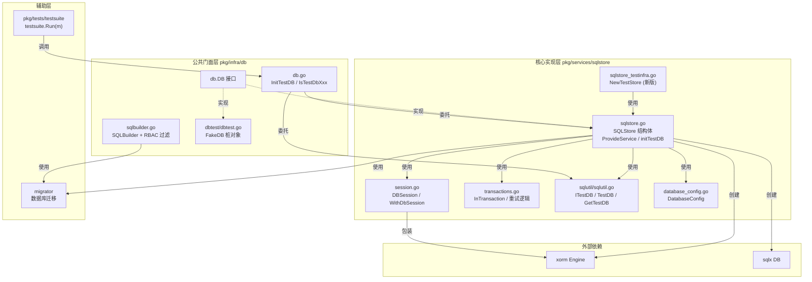

---

## 2. 核心接口: `db.DB`

定义于 `pkg/infra/db/db.go:18-49`，这是所有数据库消费者依赖的接口：

```go
type DB interface {
    WithTransactionalDbSession(ctx context.Context, callback sqlstore.DBTransactionFunc) error
    WithDbSession(ctx context.Context, callback sqlstore.DBTransactionFunc) error
    GetDialect() migrator.Dialect
    GetDBType() core.DbType
    GetEngine() *xorm.Engine
    GetSqlxSession() *session.SessionDB
    InTransaction(ctx context.Context, fn func(ctx context.Context) error) error
    Quote(value string) string
    RecursiveQueriesAreSupported() (bool, error)
}
```

这个接口是**测试策略的分水岭** -- 所有测试要么注入一个真实的 `*sqlstore.SQLStore`，要么注入一个 `*dbtest.FakeDB`。

### 2.1 接口实现关系

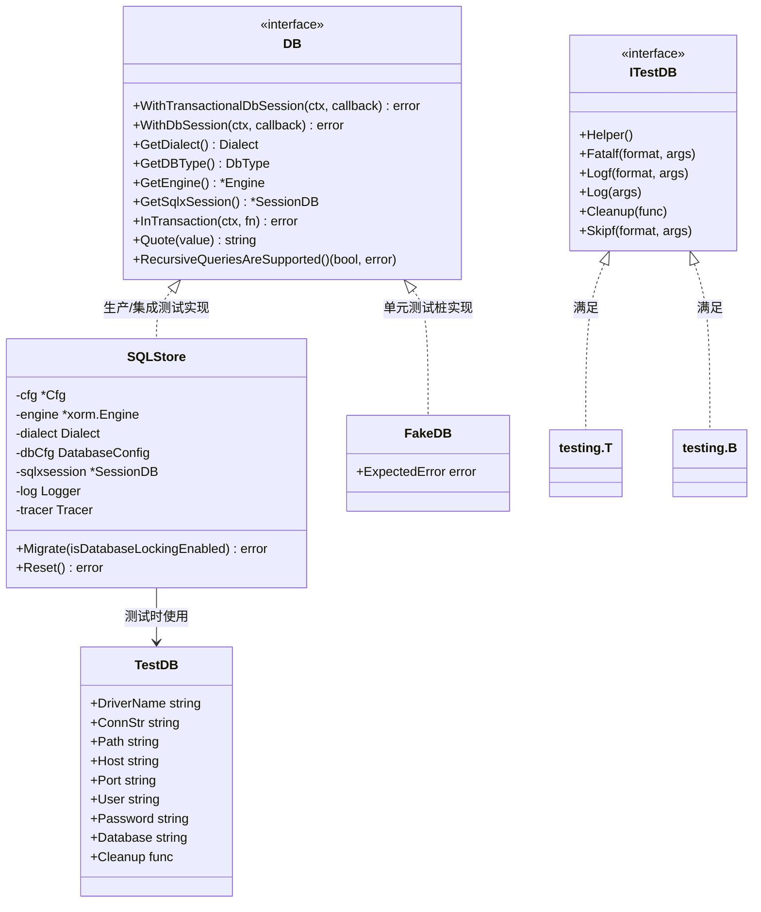

---

## 3. 两大测试策略

### 3.1 测试决策流程

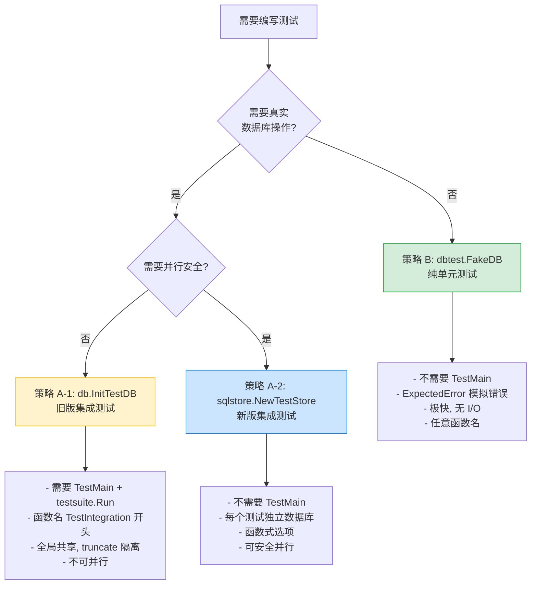

### 3.2 策略 A: 集成测试 -- `db.InitTestDB` (真实数据库)

| 维度         | 说明                                                          |
| ------------ | ------------------------------------------------------------- |
| **入口**     | `db.InitTestDB(t)` 或 `db.InitTestDBWithCfg(t)`               |
| **数据库**   | 默认 SQLite，通过 `GRAFANA_TEST_DB` 切换 MySQL/Postgres/MSSQL |
| **命名规范** | 函数名必须以 `TestIntegration` 开头                           |
| **保护守卫** | 必须调用 `testutil.SkipIntegrationTestInShortMode(t)`         |
| **TestMain** | 必须在包级 `TestMain` 中调用 `testsuite.Run(m)`               |
| **隔离机制** | 全局单例 + mutex + 每次测试前 truncate 所有表                 |
| **并行安全** | 否 (共享全局状态)                                             |

#### 旧版 InitTestDB 工作流程

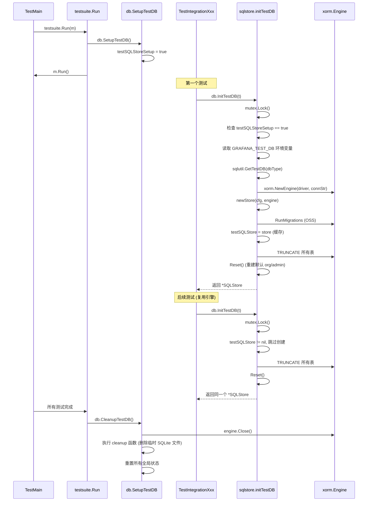

#### 典型用法示例

```go
// pkg/services/dashboardsnapshots/database/database_test.go

func TestMain(m *testing.M) {
    testsuite.Run(m) // 必须! 否则 InitTestDB 会 Fatal
}

func TestIntegrationDashboardSnapshotDBAccess(t *testing.T) {
    testutil.SkipIntegrationTestInShortMode(t)

    sqlstore := db.InitTestDB(t)
    dashStore := ProvideStore(sqlstore, setting.NewCfg())

    t.Run("Should be able to get snapshot by key", func(t *testing.T) {
        cmd := dashboardsnapshots.CreateDashboardSnapshotCommand{
            Key: "hej", DashboardEncrypted: encData, UserID: 1000, OrgID: 1,
        }
        result, err := dashStore.CreateDashboardSnapshot(context.Background(), &cmd)
        require.NoError(t, err)

        query := dashboardsnapshots.GetDashboardSnapshotQuery{Key: "hej"}
        queryResult, err := dashStore.GetDashboardSnapshot(context.Background(), &query)
        require.NoError(t, err)
        assert.NotNil(t, queryResult)
    })
}
```

#### 全局状态管理

`sqlstore.go` 中维护的关键全局变量:

```go
var testSQLStoreSetup = false          // SetupTestDB 是否已调用
var testSQLStore *SQLStore             // 全局共享的测试 SQLStore 单例
var testSQLStoreMutex sync.Mutex       // 保护并发访问
var testSQLStoreCleanup []func()       // CleanupTestDB 时执行的清理函数
```

---

### 3.3 策略 A-2: 新版集成测试 -- `NewTestStore` (并行安全)

定义于 `pkg/services/sqlstore/sqlstore_testinfra.go`，是旧版 `InitTestDB` 的全面升级。

| 对比维度      | 旧版 `InitTestDB`                  | 新版 `NewTestStore`               |
| ------------- | ---------------------------------- | --------------------------------- |
| 数据库隔离    | 全局单例 + truncate                | **每个测试独立数据库**            |
| 并行安全      | 否 (全局 mutex)                    | **是**                            |
| 需要 TestMain | 是                                 | **否**                            |
| 选项风格      | `InitTestDBOpt{FeatureFlags, Cfg}` | 函数式选项                        |
| Truncate      | 默认开启                           | **按需开启** (`WithTruncation()`) |
| Migration     | 总是运行 OSS                       | 可配置                            |

#### NewTestStore 工作流程

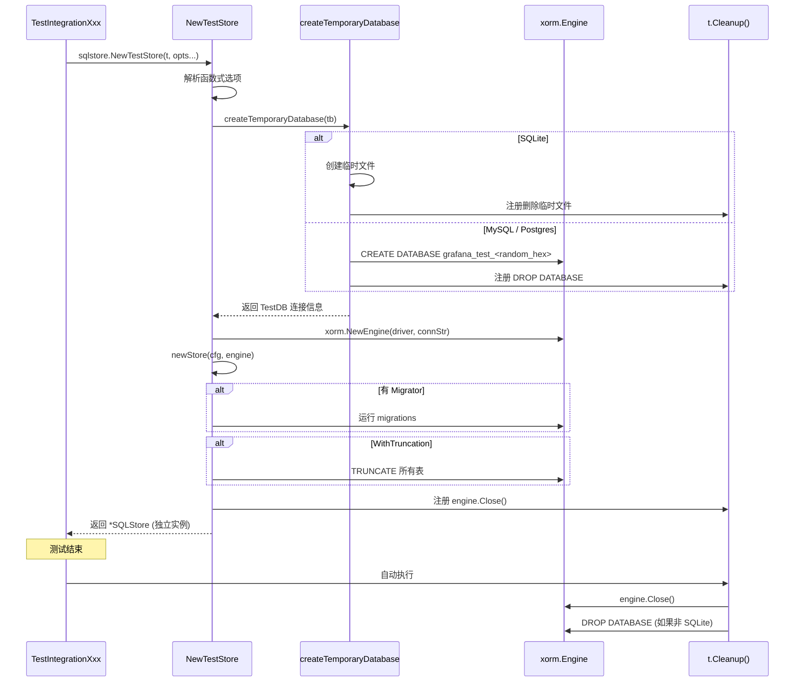

#### 可用的函数式选项

```go
WithFeatureFlags(flags map[string]bool)     // 设置 feature flags
WithFeatureFlag(flag string)                 // 开启单个 feature flag
WithoutFeatureFlags(flags ...string)         // 关闭指定 feature flags
WithOSSMigrations()                          // 使用 OSS 迁移 (默认)
WithMigrator(factory)                        // 自定义迁移器
WithoutMigrator()                            // 不运行迁移
WithTracer(tracer)                           // 自定义 tracer
WithoutDefaultOrgAndUser()                   // 不创建默认 org/admin
WithCfg(cfg)                                 // 自定义配置
WithTruncation()                             // 启用 truncate
```

#### 典型用法示例

```go
// pkg/services/sqlstore/sqlstore_testinfra_test.go

func TestIntegrationTempDatabaseConnect(t *testing.T) {
    testutil.SkipIntegrationTestInShortMode(t)
    store := sqlstore.NewTestStore(t, sqlstore.WithoutMigrator())
    // 每个测试独享数据库, 可安全并行
    err := store.WithDbSession(context.Background(), func(sess *db.Session) error {
        _, err := sess.Exec("SELECT 1")
        return err
    })
    require.NoError(t, err)
}
```

---

### 3.4 策略 B: 单元测试 -- `dbtest.FakeDB` (桩对象)

| 维度         | 说明                                       |
| ------------ | ------------------------------------------ |
| **入口**     | `dbtest.NewFakeDB()` 或 `&dbtest.FakeDB{}` |
| **数据库**   | 无 -- 所有方法返回零值或 `ExpectedError`   |
| **命名规范** | 无特殊要求                                 |
| **TestMain** | 不需要                                     |
| **速度**     | 极快 (无 I/O)                              |
| **用途**     | 测试业务逻辑、HTTP handler、服务编排       |

#### FakeDB 实现

```go
// pkg/infra/db/dbtest/dbtest.go

type FakeDB struct {
    ExpectedError error  // 唯一可配置字段
}

func NewFakeDB() *FakeDB { return &FakeDB{} }

// 所有接口方法都直接返回 ExpectedError (默认 nil)
func (f *FakeDB) WithTransactionalDbSession(ctx, callback) error { return f.ExpectedError }
func (f *FakeDB) WithDbSession(ctx, callback) error              { return f.ExpectedError }
func (f *FakeDB) InTransaction(ctx, fn) error                    { return f.ExpectedError }

// 所有 getter 返回零值
func (f *FakeDB) GetDBType() core.DbType        { return "" }
func (f *FakeDB) GetDialect() migrator.Dialect   { return nil }
func (f *FakeDB) GetEngine() *xorm.Engine        { return nil }
func (f *FakeDB) GetSqlxSession() *session.SessionDB { return nil }
func (f *FakeDB) Quote(value string) string      { return "" }
```

#### FakeDB 使用模式

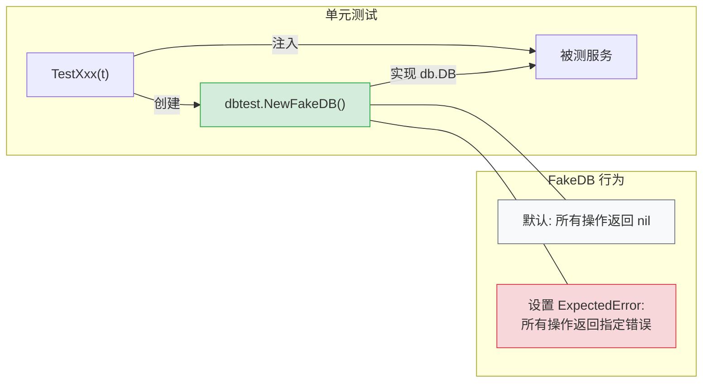

#### 典型用法示例

**示例 1: 模拟数据库故障 (Health API)**

```go
// pkg/api/health_test.go
func TestHealthAPI_DatabaseUnhealthy(t *testing.T) {
    m, hs := setupHealthAPITestEnvironment(t)
    // 注入数据库错误
    hs.SQLStore.(*dbtest.FakeDB).ExpectedError = errors.New("bad")

    req := httptest.NewRequest(http.MethodGet, "/api/health", nil)
    rec := httptest.NewRecorder()
    m.ServeHTTP(rec, req)

    require.Equal(t, 503, rec.Code)
    require.JSONEq(t, `{"database": "failing"}`, rec.Body.String())
}
```

**示例 2: 作为构造依赖占位 (Search Service)**

```go
// pkg/services/search/service_test.go
func TestSearch_SortedResults(t *testing.T) {
    db := dbtest.NewFakeDB()  // DB 只是构造依赖, 不会被真正调用
    ds := dashboards.NewFakeDashboardService(t)
    ds.On("SearchDashboards", mock.Anything, mock.Anything).Return(hits, nil)

    svc := &SearchService{sqlstore: db, dashboardService: ds}
    results, err := svc.SearchHandler(context.Background(), query)
    require.Nil(t, err)
    assert.Equal(t, "AABB", results[1].Title)
}
```

**示例 3: 预设特定错误 (Plugin Context)**

```go
// pkg/services/pluginsintegration/plugincontext/plugincontext_test.go
func TestGet(t *testing.T) {
    // 预设 "插件设置未找到" 错误
    db := &dbtest.FakeDB{ExpectedError: pluginsettings.ErrPluginSettingNotFound}
    pcp := plugincontext.ProvideService(cfg, cache, store, cacheService,
        dsService, pluginSettings.ProvideService(db, secretsService), reqCfg)

    pCtx, err := pcp.Get(context.Background(), "plugin-id", identity, orgID)
    require.NoError(t, err) // 上层服务能正确处理 "未找到" 错误
}
```

---

## 4. 多数据库 CI 测试矩阵

### 4.1 环境变量驱动机制

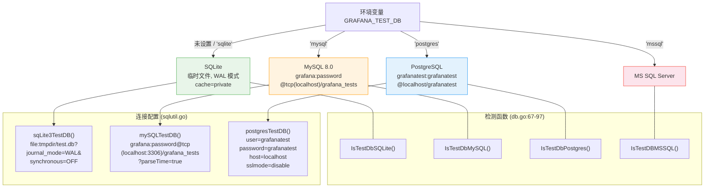

### 4.2 CI 执行策略

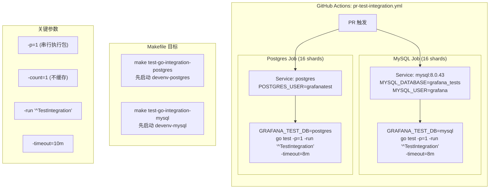

### 4.3 本地运行集成测试

```bash
# SQLite (默认, 无需额外配置)
go test -run "^TestIntegration" ./pkg/services/...

# MySQL (需要本地 MySQL 服务)
GRAFANA_TEST_DB=mysql go test -p=1 -run "^TestIntegration" ./pkg/services/...

# PostgreSQL (需要本地 Postgres 服务)
GRAFANA_TEST_DB=postgres go test -p=1 -run "^TestIntegration" ./pkg/services/...

# 使用 Makefile (自动启动 devenv 容器)
make test-go-integration-mysql
make test-go-integration-postgres
```

---

## 5. `SQLBuilder` -- 带权限过滤的 SQL 构建器

`pkg/infra/db/sqlbuilder.go` 提供了一个服务于 Dashboard 查询场景的 SQL 拼接工具。

### 5.1 结构与方法

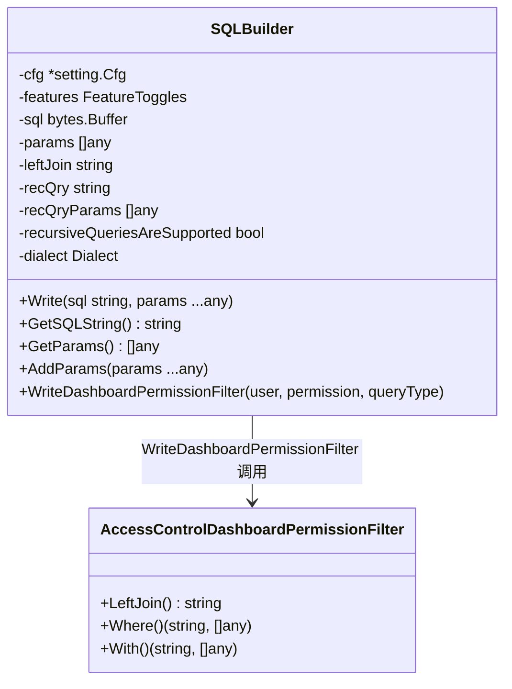

### 5.2 SQL 生成流程

`GetSQLString()` 最终拼接的 SQL 结构:

```sql
-- recQry (递归 CTE, 由 WriteDashboardPermissionFilter 注入)
WITH RECURSIVE ... AS (...)
-- sql (主查询, 由 Write() 累积)
SELECT ... FROM dashboard WHERE ...
-- leftJoin (由 WriteDashboardPermissionFilter 注入)
LEFT OUTER JOIN ...
-- WHERE 条件 (由 WriteDashboardPermissionFilter 追加 AND 子句)
AND <RBAC 权限过滤条件>
```

---

## 6. 事务与会话管理

### 6.1 会话层次结构

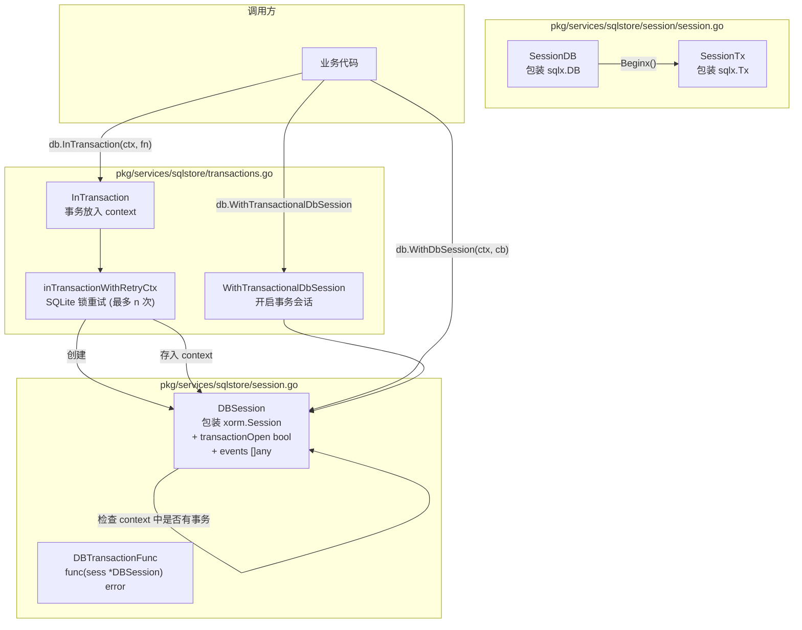

### 6.2 事务重试机制 (SQLite)

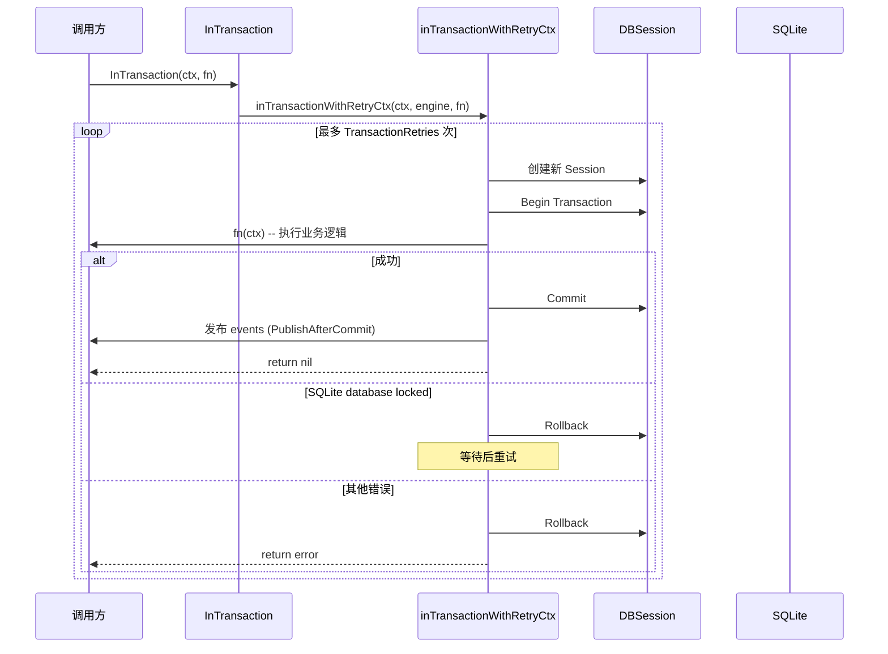

---

## 7. 完整测试生命周期

### 7.1 集成测试完整流程

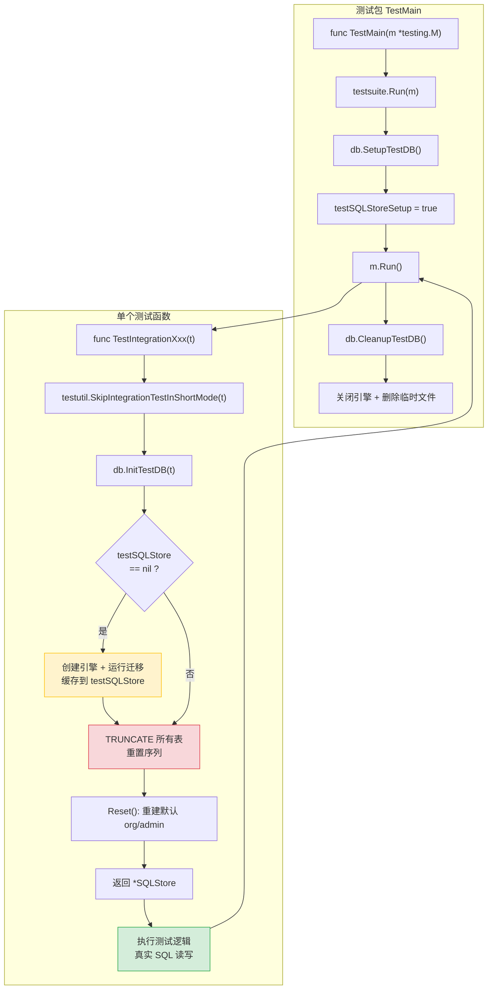

### 7.2 两代测试基础设施对比

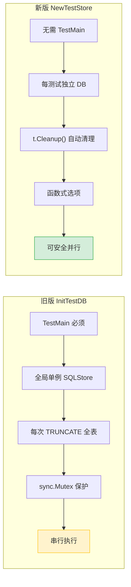

---

## 8. 总结

### 8.1 核心设计理念

1. **接口隔离** -- `db.DB` 接口使得真实实现 (`SQLStore`) 和桩对象 (`FakeDB`) 可互换，测试策略由注入决定
2. **环境变量驱动** -- 同一套测试代码通过 `GRAFANA_TEST_DB` 运行在不同数据库上，无需修改测试代码
3. **约定优于配置** -- `TestIntegration` 前缀 + `testsuite.Run` 的固定模式，CI 通过 `-run "^TestIntegration"` 精确筛选
4. **渐进演进** -- 旧版 `InitTestDB` (全局单例) 和新版 `NewTestStore` (每测试隔离) 两套共存，逐步迁移

### 8.2 选型指南

| 场景                      | 推荐策略                          | 理由                            |
| ------------------------- | --------------------------------- | ------------------------------- |
| HTTP handler / API 层测试 | `dbtest.FakeDB`                   | DB 只是构造依赖，不会被真正调用 |
| 服务编排 / 业务逻辑测试   | `dbtest.FakeDB`                   | 关注逻辑分支，不关注 SQL        |
| 数据库错误处理测试        | `dbtest.FakeDB` + `ExpectedError` | 精确控制错误场景                |
| SQL 查询正确性验证        | `db.InitTestDB` 或 `NewTestStore` | 需要真实 SQL 执行               |
| 数据库迁移测试            | `NewTestStore` + `WithMigrator()` | 需要独立 schema                 |
| 事务/并发测试             | `NewTestStore`                    | 需要并行安全的独立数据库        |
| 跨数据库兼容性验证        | `db.InitTestDB` + CI 矩阵         | 通过 `GRAFANA_TEST_DB` 切换     |
