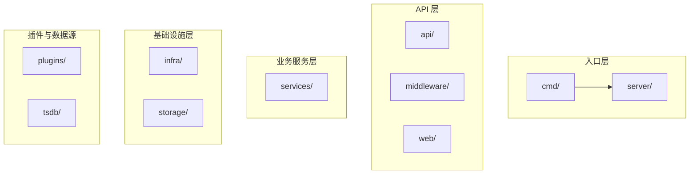
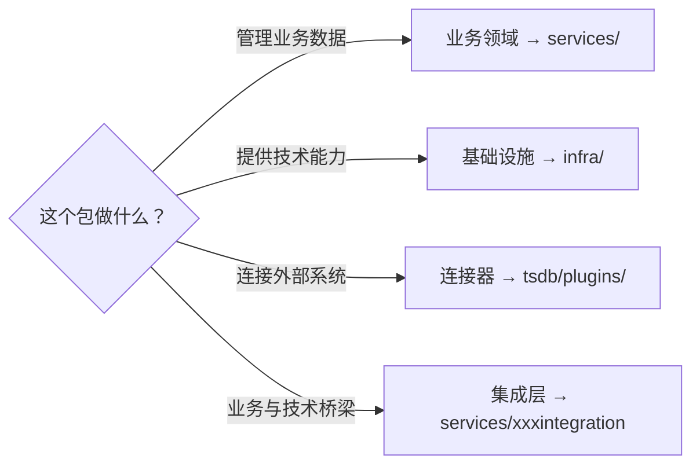

# Grafana Backend

This directory contains the code for the Grafana backend.

The contributor documentation for Grafana's backend is in
[/contribute/backend/README.md](/contribute/backend/README.md).

## 分包架构



## 核心包职责

| 包名 | 职责 | 设计理由 |
|------|------|---------|
| **cmd/** | CLI 入口点 | 分离启动逻辑，支持多种运行模式 |
| **server/** | 服务器生命周期 | 集中管理依赖注入和启动流程 |
| **api/** | HTTP API 路由和处理器 | 表现层与业务层分离 |
| **services/** | 业务逻辑服务 | 核心业务逻辑，依赖注入友好 |
| **infra/** | 基础设施（日志、缓存、DB） | 底层能力抽象，可替换实现 |
| **storage/** | 统一存储层 | 支持 SQL 和 K8s 风格存储 |
| **plugins/** | 插件管理系统 | 插件加载、生命周期、安全沙箱 |
| **tsdb/** | 时序数据库连接器 | 各类数据源实现 |
| **setting/** | 配置管理 | 集中配置读取和验证 |
| **util/** | 通用工具函数 | 避免循环依赖 |

## 依赖方向

```
cmd → server → api → services → infra → util
                 ↓
              plugins/tsdb
```

> [!IMPORTANT]
> 上层可以依赖下层，但下层不能依赖上层。

## services 子包逻辑

`services/` 包含所有业务服务：

| 子包 | 职责 |
|------|------|
| `accesscontrol/` | 访问控制/RBAC |
| `auth/` | 认证 |
| `datasources/` | 数据源管理 |
| `dashboards/` | 仪表盘服务 |
| `secrets/` | 密钥管理 |
| `encryption/` | 加密服务 |
| `user/` | 用户管理 |
| `featuremgmt/` | 特性开关 |

## 分包判断标准



### 什么放 services/

- ✅ 代表**业务领域**（用户、组织、告警）
- ✅ 有**业务数据模型**
- ✅ 需要**持久化**
- ✅ 通过 **Wire 依赖注入**

### 什么放 pkg/顶层

- ✅ **运行时引擎**（expr 表达式）
- ✅ **基础设施**（日志、缓存）
- ✅ **协议/连接器**（数据源）
- ✅ **无状态工具**

### 特殊情况

| services/ 里的包 | 类型 | 备注 |
|----------------|------|------|
| `user/`, `org/` | 纯业务领域 | |
| `accesscontrol/` | 业务领域 | 权限是独立业务 |
| `pluginsintegration/` | 集成层 | 插件与业务服务的桥梁 |
| `sqlstore/` | **历史遗留** ⚠️ | 应属于 infra，正在迁移 |
| `grpcserver/` | **历史遗留** ⚠️ | 应属于 infra |

> [!NOTE]
> 由于历史演进，部分包位置不够理想，正在逐步重构。

## infra 基础设施

| 子包 | 职责 |
|------|------|
| `db/` | 数据库抽象 |
| `log/` | 日志 |
| `tracing/` | 链路追踪 |
| `metrics/` | 指标采集 |
| `kvstore/` | 键值存储 |
| `remotecache/` | 远程缓存 |

## K8s 风格 API 层

| 包 | 职责 |
|-----|------|
| `apis/` | K8s API 类型定义 |
| `apimachinery/` | K8s 通用机制 |
| `apiserver/` | K8s API Server 基础设施 |
| `registry/` | API 资源注册 |

## 设计原则

| 原则 | 体现 |
|------|------|
| 单一职责 | 每个包有明确边界 |
| 依赖倒置 | 通过接口解耦 |
| 可测试性 | 接口+依赖注入 |
| 可扩展性 | 插件架构、Provider 模式 |
| 云原生演进 | K8s API 风格包结构 |

## 演进趋势

```
传统单体 → 模块化 → 微服务化
   ↓          ↓          ↓
services/  modules/   apiserver/
           server/    storage/
           target
```

Grafana 正在从单体架构向**可独立部署的模块**演进。
