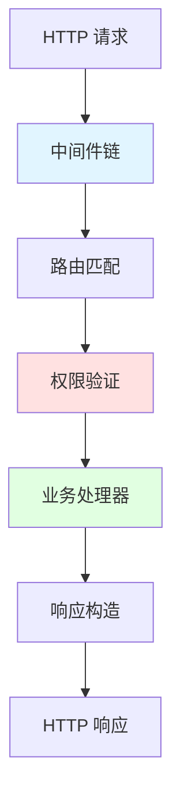
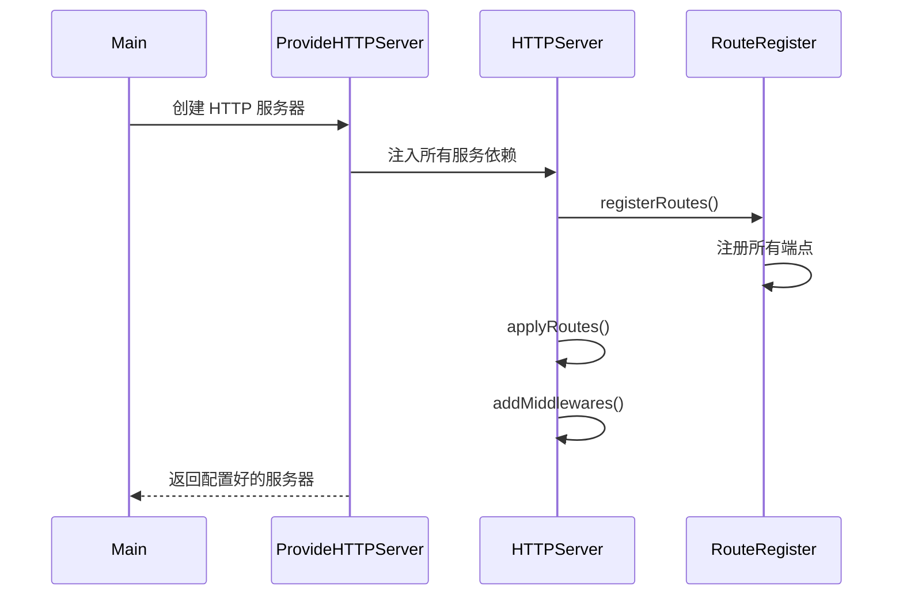
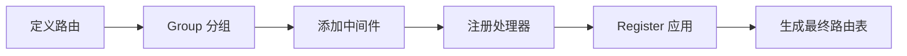
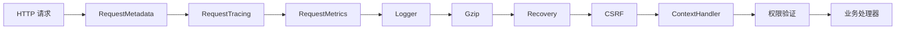
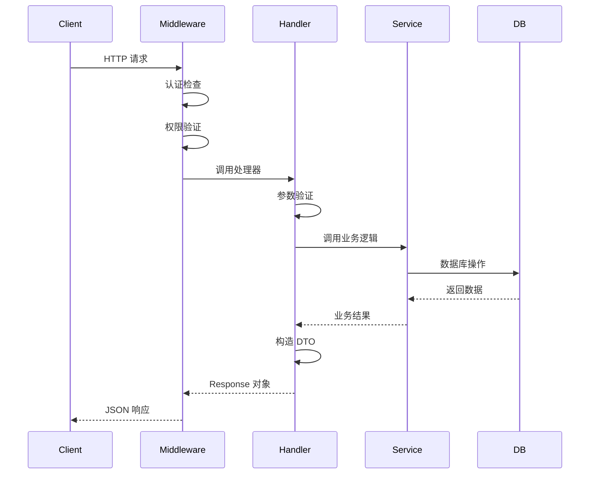
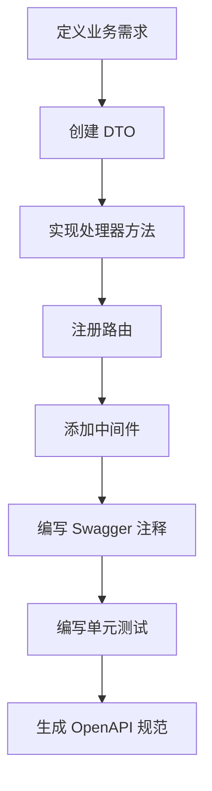

# Grafana pkg/api 源码深度解析

> **文档版本**: v1.0  
> **分析日期**: 2026-02-09  
> **Grafana 版本**: main 分支

## 📋 目录

- [架构概览](#架构概览)
- [核心组件分析](#核心组件分析)
- [HTTP 路由系统](#http-路由系统)
- [中间件机制](#中间件机制)
- [请求响应处理](#请求响应处理)
- [OpenAPI 集成](#openapi-集成)
- [实践建议](#实践建议)

---

## 架构概览

### 目录结构

`pkg/api` 是 Grafana HTTP API 层的核心实现，包含以下关键组成部分：

```
pkg/api/
├── api.go                    # 路由注册中心
├── http_server.go            # HTTP 服务器实现
├── routing/                  # 路由注册器
│   ├── route_register.go     # 路由注册逻辑
│   └── routing.go            # 路由接口定义
├── response/                 # 响应处理
│   ├── response.go           # 响应对象实现
│   └── web_hack.go           # Web 框架适配
├── dtos/                     # 数据传输对象
│   ├── models.go             # 核心模型
│   ├── dashboard.go          # Dashboard DTOs
│   ├── datasource.go         # DataSource DTOs
│   └── ...                   # 其他领域DTOs
├── apierrors/                # API 错误处理
├── pluginproxy/              # 插件代理
├── frontendlogging/          # 前端日志
└── [功能模块].go             # 各业务端点实现
    ├── dashboard.go          # Dashboard API
    ├── datasources.go        # DataSource API
    ├── user.go               # User API
    ├── org.go                # Organization API
    └── ...
```

### 设计理念



**核心设计原则**：

1. **分层架构**: 清晰分离路由、中间件、处理器、响应
2. **依赖注入**: 通过构造函数注入所有服务依赖
3. **统一错误处理**: 使用 `response.Response` 接口统一响应格式
4. **权限集成**: 深度集成 RBAC 权限控制
5. **可测试性**: 通过接口抽象便于单元测试

---

## 核心组件分析

### 1. HTTPServer 结构体

[`http_server.go`](file:///Users/wangxiaowei1/xiaowei/grafana/pkg/api/http_server.go#L118-L225) 定义了核心的 HTTP 服务器结构：

```go
type HTTPServer struct {
    // 核心组件
    log              log.Logger
    web              *web.Mux              // Web 路由引擎
    RouteRegister    routing.RouteRegister // 路由注册器
    ContextHandler   *contexthandler.ContextHandler
    
    // 依赖服务 (精简展示)
    Cfg                   *setting.Cfg
    AccessControl         accesscontrol.AccessControl
    DashboardService      dashboards.DashboardService
    DataSourcesService    datasources.DataSourceService
    userService           user.Service
    // ... 50+ 个服务依赖
}
```

> [!IMPORTANT]
> **关键设计**: `HTTPServer` 通过依赖注入获取所有业务服务，避免直接耦合。这使得测试时可以轻松替换 mock 实现。

**初始化流程**：



### 2. 路由注册系统

#### RouteRegister 接口

[`routing/route_register.go`](file:///Users/wangxiaowei1/xiaowei/grafana/pkg/api/routing/route_register.go#L16-L50) 定义了路由注册的核心接口：

```go
type RouteRegister interface {
    Get(string, ...web.Handler)
    Post(string, ...web.Handler)
    Delete(string, ...web.Handler)
    Put(string, ...web.Handler)
    Patch(string, ...web.Handler)
    Any(string, ...web.Handler)
    
    // 核心方法
    Group(prefix string, fn func(RouteRegister), ...web.Handler)
    Insert(pattern string, fn func(RouteRegister), ...web.Handler)
    Register(Router, ...RegisterNamedMiddleware)
}
```

**路由分组示例** ([api.go:L278-L303](file:///Users/wangxiaowei1/xiaowei/grafana/pkg/api/api.go#L278-L303))：

```go
r.Group("/api", func(apiRoute routing.RouteRegister) {
    // 用户相关路由
    apiRoute.Group("/user", func(userRoute routing.RouteRegister) {
        userRoute.Get("/", routing.Wrap(hs.GetSignedInUser))
        userRoute.Put("/", routing.Wrap(hs.UpdateSignedInUser))
        userRoute.Get("/orgs", routing.Wrap(hs.GetSignedInUserOrgList))
    }, reqSignedInNoAnonymous) // 组级中间件
})
```

> [!TIP]
> **路由分组优势**:
> - 统一的路径前缀管理
> - 共享中间件逻辑
> - 清晰的API层级结构

#### 路由实现机制

[`RouteRegisterImpl`](file:///Users/wangxiaowei1/xiaowei/grafana/pkg/api/routing/route_register.go#L74-L80) 内部维护路由树：

```go
type RouteRegisterImpl struct {
    prefix           string           // 路径前缀
    subfixHandlers   []web.Handler    // 组级中间件
    namedMiddlewares []RegisterNamedMiddleware
    routes           []route          // 当前组的路由
    groups           []*RouteRegisterImpl // 子路由组
}
```

**注册流程**：



### 3. 响应系统

#### Response 接口

[`response/response.go`](file:///Users/wangxiaowei1/xiaowei/grafana/pkg/api/response/response.go#L24-L32) 定义了统一的响应接口：

```go
type Response interface {
    WriteTo(ctx *contextmodel.ReqContext)
    Body() []byte
    Status() int
}
```

**三种响应类型**：

##### 1. NormalResponse - 标准响应

```go
type NormalResponse struct {
    status     int
    body       *bytes.Buffer
    header     http.Header
    errMessage string
    err        error
}
```

**使用示例**：

```go
// 成功响应
func (hs *HTTPServer) GetDashboard(c *contextmodel.ReqContext) response.Response {
    dashboard, err := hs.DashboardService.GetDashboard(ctx, uid)
    if err != nil {
        return response.Error(404, "Dashboard not found", err)
    }
    
    return response.JSON(200, dtos.DashboardFullWithMeta{
        Dashboard: dashboard,
        Meta:      meta,
    })
}
```

##### 2. StreamingResponse - 流式响应

```go
type StreamingResponse struct {
    body   any
    status int
    header http.Header
}

// 用于大数据集
func JSONStreaming(status int, body any) StreamingResponse {
    return StreamingResponse{
        body:   body,
        status: status,
        header: http.Header{"Content-Type": {"application/json"}},
    }
}
```

##### 3. RedirectResponse - 重定向

```go
type RedirectResponse struct {
    location string
}

func Redirect(location string) *RedirectResponse {
    return &RedirectResponse{location: location}
}
```

#### 便捷响应函数

```go
// 成功响应
response.JSON(200, data)
response.Success("操作成功")

// 错误响应
response.Error(500, "Internal error", err)
response.Err(errutil.BadRequest("invalid.param"))
response.ErrOrFallback(500, "Fallback message", err)

// 文件下载
response.JSONDownload(200, data, "export.json")
response.YAMLDownload(200, data, "config.yaml")

// 空响应
response.Empty(204)
```

> [!WARNING]
> **错误处理最佳实践**:
> - 使用 `response.Err()` 处理 `errutil.Error` 类型错误
> - 使用 `response.ErrOrFallback()` 处理未知错误
> - 避免直接使用 `response.Error()` 除非确定不是 errutil.Error

---

## HTTP 路由系统

### 路由注册入口

[`api.go:L62-L608`](file:///Users/wangxiaowei1/xiaowei/grafana/pkg/api/api.go#L62-L608) 包含所有路由注册逻辑：

```go
func (hs *HTTPServer) registerRoutes() {
    // 1. 定义中间件快捷方式
    reqSignedIn := middleware.ReqSignedIn
    reqOrgAdmin := middleware.ReqOrgAdmin
    authorize := ac.Middleware(hs.AccessControl)
    
    r := hs.RouteRegister
    
    // 2. 公开路由 (无需认证)
    r.Get("/logout", hs.Logout)
    r.Post("/login", quota(...), routing.Wrap(hs.LoginPost))
    
    // 3. 认证后的视图路由
    r.Get("/", reqSignedIn, hs.Index)
    r.Get("/dashboards/", reqSignedIn, hs.Index)
    
    // 4. API 路由组
    r.Group("/api", func(apiRoute routing.RouteRegister) {
        // ... 详细的 API 端点
    }, reqSignedIn)
}
```

### 典型路由模式

#### 1. Dashboard API

```go
apiRoute.Group("/dashboards", func(dashboardRoute routing.RouteRegister) {
    dashUIDScope := dashboards.ScopeDashboardsProvider.GetResourceScopeUID(
        ac.Parameter(":uid")
    )
    
    // 权限检查集成
    dashboardRoute.Get("/uid/:uid", 
        authorize(ac.EvalPermission(dashboards.ActionDashboardsRead, dashUIDScope)),
        routing.Wrap(hs.GetDashboard))
    
    dashboardRoute.Delete("/uid/:uid",
        authorize(ac.EvalPermission(dashboards.ActionDashboardsDelete, dashUIDScope)),
        routing.Wrap(hs.DeleteDashboardByUID))
        
    // 嵌套路由组
    dashboardRoute.Group("/uid/:uid", func(dashUidRoute routing.RouteRegister) {
        dashUidRoute.Get("/versions", 
            authorize(...),
            routing.Wrap(hs.GetDashboardVersions))
    })
})
```

#### 2. DataSource API

```go
apiRoute.Group("/datasources", func(datasourceRoute routing.RouteRegister) {
    uidScope := datasources.ScopeProvider.GetResourceScopeUID(ac.Parameter(":uid"))
    
    // 标准 CRUD
    datasourceRoute.Get("/", 
        authorize(ac.EvalPermission(datasources.ActionRead)),
        routing.Wrap(hs.GetDataSources))
    
    datasourceRoute.Post("/",
        authorize(ac.EvalPermission(datasources.ActionCreate)),
        quota(string(datasources.QuotaTargetSrv)),
        routing.Wrap(hs.AddDataSource))
    
    // 代理请求 (高延迟标记)
    datasourceRoute.Any("/uid/:uid/resources/*",
        requestmeta.SetSLOGroup(requestmeta.SLOGroupHighSlow),
        authorize(ac.EvalPermission(datasources.ActionQuery)),
        hs.CallDatasourceResourceWithUID)
})
```

> [!NOTE]
> **SLO 分组**: `SetSLOGroup(SLOGroupHighSlow)` 用于标记高延迟请求，在监控和告警中区别对待。

#### 3. 用户 API

```go
apiRoute.Group("/user", func(userRoute routing.RouteRegister) {
    userRoute.Get("/", routing.Wrap(hs.GetSignedInUser))
    userRoute.Put("/", routing.Wrap(hs.UpdateSignedInUser))
    
    // 星标功能
    userRoute.Post("/stars/dashboard/uid/:uid",
        routing.Wrap(hs.starApi.StarDashboardByUID))
    userRoute.Delete("/stars/dashboard/uid/:uid",
        routing.Wrap(hs.starApi.UnstarDashboardByUID))
        
    // 偏好设置
    userRoute.Get("/preferences", routing.Wrap(hs.GetUserPreferences))
    userRoute.Put("/preferences", routing.Wrap(hs.UpdateUserPreferences))
    userRoute.Patch("/preferences", routing.Wrap(hs.PatchUserPreferences))
}, reqSignedInNoAnonymous)
```

### 路由处理器模式

#### Wrap 函数的作用

```go
// routing.Wrap 将处理器函数转换为 web.Handler
func Wrap(handler func(*contextmodel.ReqContext) response.Response) web.Handler {
    return func(c *web.Context) {
        reqCtx := contextmodel.FromContext(c)
        resp := handler(reqCtx)
        resp.WriteTo(reqCtx)
    }
}
```

**处理器签名**：

```go
func (hs *HTTPServer) GetDashboard(c *contextmodel.ReqContext) response.Response {
    // 1. 从上下文获取参数
    uid := web.Params(c.Req)[":uid"]
    
    // 2. 调用服务层
    dashboard, err := hs.DashboardService.GetDashboard(c.Req.Context(), ...)
    if err != nil {
        return response.Error(500, "Failed to get dashboard", err)
    }
    
    // 3. 构造响应
    return response.JSON(200, dashboardDTO)
}
```

---

## 中间件机制

### 中间件调用链



### 核心中间件

#### 1. 请求上下文中间件

[`http_server.go:L633-L698`](file:///Users/wangxiaowei1/xiaowei/grafana/pkg/api/http_server.go#L633-L698) 定义了中间件链：

```go
func (hs *HTTPServer) addMiddlewaresAndStaticRoutes() {
    m := hs.web
    
    // 元数据跟踪
    m.Use(requestmeta.SetupRequestMetadata())
    
    // 分布式追踪
    m.Use(middleware.RequestTracing(hs.tracer, ...))
    
    // Prometheus 指标
    m.Use(middleware.RequestMetrics(hs.Features, hs.Cfg, hs.promRegister))
    
    // 结构化日志
    m.UseMiddleware(hs.LoggerMiddleware.Middleware())
    
    // Gzip 压缩
    if hs.Cfg.EnableGzip {
        m.UseMiddleware(middleware.Gziper())
    }
    
    // Panic 恢复
    m.UseMiddleware(middleware.Recovery(hs.Cfg, hs.License))
    
    // CSRF 保护
    m.UseMiddleware(hs.Csrf.Middleware())
    
    // 上下文处理器 (认证/授权)
    m.UseMiddleware(hs.ContextHandler.Middleware)
    
    // 组织重定向
    m.Use(middleware.OrgRedirect(hs.Cfg, hs.userService))
}
```

#### 2. 认证中间件

```go
// ReqSignedIn - 要求用户已登录
func ReqSignedIn(c *contextmodel.ReqContext) {
    if !c.IsSignedIn {
        c.JsonApiErr(401, "Unauthorized", nil)
        return
    }
}

// ReqSignedInNoAnonymous - 禁止匿名访问
func ReqSignedInNoAnonymous(c *contextmodel.ReqContext) {
    if !c.IsSignedIn || c.IsAnonymous {
        c.JsonApiErr(401, "Unauthorized", nil)
        return
    }
}

// ReqGrafanaAdmin - 要求 Grafana 管理员权限
func ReqGrafanaAdmin(c *contextmodel.ReqContext) {
    if !c.IsGrafanaAdmin {
        c.JsonApiErr(403, "Permission denied", nil)
        return
    }
}
```

#### 3. 权限中间件

```go
// 资源级别权限
dashUIDScope := dashboards.ScopeDashboardsProvider.GetResourceScopeUID(
    ac.Parameter(":uid")
)

authorize := ac.Middleware(hs.AccessControl)

r.Get("/dashboards/uid/:uid",
    authorize(ac.EvalPermission(
        dashboards.ActionDashboardsRead,
        dashUIDScope,
    )),
    routing.Wrap(hs.GetDashboard))
```

**权限评估器**：

```go
// 简单权限
ac.EvalPermission(action, scope)

// 复合权限 (任意满足)
ac.EvalAny(
    ac.EvalPermission(ac.ActionOrgUsersRead),
    ac.EvalPermission(ac.ActionTeamsPermissionsWrite),
)

// 复合权限 (全部满足)
ac.EvalAll(
    ac.EvalPermission(...),
    ac.EvalPermission(...),
)
```

#### 4. 配额中间件

```go
quota := middleware.Quota(hs.QuotaService)

r.Post("/api/user/signup",
    quota(user.QuotaTargetSrv),
    quota(org.QuotaTargetSrv),
    routing.Wrap(hs.SignUp))
```

#### 5. 请求元数据中间件

```go
// 设置请求所有者
requestmeta.SetOwner(requestmeta.TeamAuth)

// 设置 SLO 分组
requestmeta.SetSLOGroup(requestmeta.SLOGroupHighSlow)
```

---

## 请求响应处理

### DTOs (数据传输对象)

[`dtos/`](file:///Users/wangxiaowei1/xiaowei/grafana/pkg/api/dtos) 目录包含所有API的输入输出模型：

#### 核心 DTO

[`dtos/models.go`](file:///Users/wangxiaowei1/xiaowei/grafana/pkg/api/dtos/models.go):

```go
// 当前用户信息
type CurrentUser struct {
    IsSignedIn     bool             `json:"isSignedIn"`
    Id             int64            `json:"id"`
    Login          string           `json:"login"`
    Email          string           `json:"email"`
    OrgRole        org.RoleType     `json:"orgRole"`
    Permissions    UserPermissionsMap `json:"permissions,omitempty"`
    // ...
}

// 查询请求
type MetricRequest struct {
    From    string              `json:"from"`
    To      string              `json:"to"`
    Queries []*simplejson.Json  `json:"queries"`
    Debug   bool                `json:"debug"`
}
```

#### Dashboard DTOs

[`dtos/dashboard.go`](file:///Users/wangxiaowei1/xiaowei/grafana/pkg/api/dtos/dashboard.go):

```go
type DashboardFullWithMeta struct {
    Meta      DashboardMeta         `json:"meta"`
    Dashboard *simplejson.Json      `json:"dashboard"`
}

type DashboardMeta struct {
    IsStarred       bool      `json:"isStarred"`
    Slug            string    `json:"slug"`
    FolderUID       string    `json:"folderUid"`
    CanSave         bool      `json:"canSave"`
    CanEdit         bool      `json:"canEdit"`
    CanAdmin        bool      `json:"canAdmin"`
    Created         time.Time `json:"created"`
    Updated         time.Time `json:"updated"`
    Version         int       `json:"version"`
}
```

### 典型请求处理流程



### Dashboard 处理示例

```go
func (hs *HTTPServer) GetDashboard(c *contextmodel.ReqContext) response.Response {
    // 1. 获取 URL 参数
    uid := web.Params(c.Req)[":uid"]
    
    // 2. 获取 Dashboard
    dash, rsp := hs.getDashboardHelper(c.Req.Context(), c.SignedInUser.OrgID, 0, uid)
    if rsp != nil {
        return rsp
    }
    
    // 3. 检查是否已星标
    isStarred, err := hs.isDashboardStarredByUser(c, dash.UID)
    if err != nil {
        return response.Error(500, "Failed to check starred status", err)
    }
    
    // 4. 获取 Guardian (权限检查器)
    g, err := guardian.NewByDashboard(c.Req.Context(), dash, c.SignedInUser.OrgID, c.SignedInUser)
    if err != nil {
        return dashboardGuardianResponse(err)
    }
    
    // 5. 检查查看权限
    if canView, err := g.CanView(); err != nil || !canView {
        return dashboardGuardianResponse(err)
    }
    
    // 6. 获取权限元数据
    canEdit, _ := g.CanEdit()
    canSave, _ := g.CanSave()
    canAdmin, _ := g.CanAdmin()
    
    // 7. 构造响应 DTO
    meta := dtos.DashboardMeta{
        IsStarred: isStarred,
        Slug:      dash.Slug,
        CanEdit:   canEdit,
        CanSave:   canSave,
        CanAdmin:  canAdmin,
        Created:   dash.Created,
        Updated:   dash.Updated,
        Version:   dash.Version,
    }
    
    dto := dtos.DashboardFullWithMeta{
        Dashboard: dash.Data,
        Meta:      meta,
    }
    
    // 8. 返回 JSON 响应
    return response.JSON(200, dto)
}
```

---

## OpenAPI 集成

### Swagger 注释规范

Grafana 使用 [go-swagger](https://github.com/go-swagger/go-swagger) 生成 OpenAPI 规范：

#### 端点注释

```go
// swagger:route GET /dashboards/uid/{uid} dashboards getDashboardByUID
//
// # Get dashboard by uid.
//
// Will return the dashboard given the dashboard unique identifier (uid).
//
// Responses:
// 200: dashboardResponse
// 401: unauthorisedError
// 403: forbiddenError
// 404: notFoundError
// 500: internalServerError
func (hs *HTTPServer) GetDashboard(c *contextmodel.ReqContext) response.Response {
    // ...
}
```

**注释结构**：

1. `swagger:route` - 定义路由
   - HTTP 方法: `GET`, `POST`, `PUT`, `DELETE`, `PATCH`
   - 路径: `/dashboards/uid/{uid}`
   - 标签: `dashboards` (用于分组)
   - 操作ID: `getDashboardByUID` (唯一标识符)

2. 描述文本 - Markdown 格式
3. `Responses` - 状态码和响应模型映射

#### 参数注释

```go
// swagger:parameters updateServiceAccount
type UpdateServiceAccountParams struct {
    // in:path
    ServiceAccountId int64 `json:"serviceAccountId"`
    // in:body
    Body serviceaccounts.UpdateServiceAccountForm
}
```

**参数位置**：

- `in:path` - URL 路径参数
- `in:query` - 查询字符串参数
- `in:body` - 请求体
- `in:header` - HTTP 头部

#### 响应注释

```go
// swagger:response dashboardResponse
type DashboardResponse struct {
    // in:body
    Body dtos.DashboardFullWithMeta
}
```

### 生成规范

```bash
# 清理并重新生成
make swagger-clean && make openapi3-gen
```

**生成文件**：

- `public/api-merged.json` - OpenAPI v2 规范
- `public/openapi3.json` - OpenAPI v3 规范

**在线查看**：

访问 `/swagger` 路径查看 Swagger UI。

---

## 实践建议

### 1. 添加新的 API 端点

#### 步骤流程



#### 代码示例

**1. 定义 DTO** (`dtos/example.go`):

```go
package dtos

type CreateExampleRequest struct {
    Name        string `json:"name" binding:"Required"`
    Description string `json:"description"`
}

type ExampleDTO struct {
    ID          int64  `json:"id"`
    Name        string `json:"name"`
    Description string `json:"description"`
}
```

**2. 实现处理器** (`example.go`):

```go
// swagger:route POST /examples examples createExample
//
// # Create a new example
//
// Responses:
// 200: exampleResponse
// 400: badRequestError
// 401: unauthorisedError
// 500: internalServerError
func (hs *HTTPServer) CreateExample(c *contextmodel.ReqContext) response.Response {
    // 绑定请求体
    cmd := dtos.CreateExampleRequest{}
    if err := web.Bind(c.Req, &cmd); err != nil {
        return response.Error(400, "Invalid request", err)
    }
    
    // 调用服务层
    example, err := hs.exampleService.Create(c.Req.Context(), cmd)
    if err != nil {
        return response.ErrOrFallback(500, "Failed to create example", err)
    }
    
    // 返回响应
    return response.JSON(200, dtos.ExampleDTO{
        ID:          example.ID,
        Name:        example.Name,
        Description: example.Description,
    })
}
```

**3. 注册路由** (`api.go`):

```go
func (hs *HTTPServer) registerRoutes() {
    // ...
    
    apiRoute.Group("/examples", func(exampleRoute routing.RouteRegister) {
        exampleRoute.Post("/",
            authorize(ac.EvalPermission(examples.ActionCreate)),
            quota(examples.QuotaTargetSrv),
            routing.Wrap(hs.CreateExample))
        
        exampleRoute.Get("/:id",
            authorize(ac.EvalPermission(examples.ActionRead, exampleScope)),
            routing.Wrap(hs.GetExample))
    })
}
```

**4. Swagger 参数定义**:

```go
// swagger:parameters createExample
type CreateExampleParams struct {
    // in:body
    Body dtos.CreateExampleRequest
}

// swagger:response exampleResponse
type ExampleResponse struct {
    // in:body
    Body dtos.ExampleDTO
}
```

### 2. 错误处理最佳实践

```go
// ✅ 推荐：使用 errutil.Error
if err != nil {
    return response.Err(errutil.NotFound("example.notFound").Errorf("example %d not found", id))
}

// ✅ 推荐：ErrOrFallback 处理未知错误
if err != nil {
    return response.ErrOrFallback(500, "Operation failed", err)
}

// ❌ 避免：直接使用 Error() 除非确定不是 errutil.Error
if err != nil {
    return response.Error(500, "Something went wrong", err)
}
```

### 3. 权限检查模式

```go
// 简单权限
authorize(ac.EvalPermission(
    examples.ActionRead,
    examples.ScopeProvider.GetResourceScope(ac.Parameter(":id")),
))

// 复合权限 - 任意满足
authorize(ac.EvalAny(
    ac.EvalPermission(examples.ActionRead),
    ac.EvalPermission(examples.ActionReadPublic),
))

// 跨组织权限
authorizeInOrg(ac.UseOrgFromContextParams,
    ac.EvalPermission(examples.ActionRead))
```

### 4. 性能优化建议

#### 使用请求元数据

```go
// 标记高延迟请求
requestmeta.SetSLOGroup(requestmeta.SLOGroupHighSlow)

// 标记请求所有者团队
requestmeta.SetOwner(requestmeta.TeamPlugins)
```

#### 并发处理

```go
func (hs *HTTPServer) GetMultipleDashboards(c *contextmodel.ReqContext) response.Response {
    var wg sync.WaitGroup
    results := make([]dtos.DashboardDTO, len(uids))
    errs := make([]error, len(uids))
    
    for i, uid := range uids {
        wg.Add(1)
        go func(idx int, dashUID string) {
            defer wg.Done()
            dash, err := hs.DashboardService.GetDashboard(ctx, dashUID)
            results[idx] = convertToDTO(dash)
            errs[idx] = err
        }(i, uid)
    }
    
    wg.Wait()
    
    // 错误聚合处理
    for _, err := range errs {
        if err != nil {
            return response.Error(500, "Partial failure", err)
        }
    }
    
    return response.JSON(200, results)
}
```

### 5. 测试策略

#### 单元测试示例

```go
func TestCreateExample(t *testing.T) {
    // 设置 mock 服务
    mockService := &mockExampleService{}
    hs := &HTTPServer{
        exampleService: mockService,
    }
    
    // 准备测试请求
    reqBody := `{"name":"test","description":"test desc"}`
    req := httptest.NewRequest("POST", "/api/examples", strings.NewReader(reqBody))
    
    // 创建上下文
    c := &contextmodel.ReqContext{
        Req:          req,
        SignedInUser: &user.SignedInUser{UserID: 1, OrgID: 1},
    }
    
    // 执行处理器
    resp := hs.CreateExample(c)
    
    // 断言响应
    assert.Equal(t, 200, resp.Status())
    assert.Contains(t, string(resp.Body()), "test")
}
```

---

## 总结

### 核心要点

| 组件 | 职责 | 关键文件 |
|------|------|----------|
| **HTTPServer** | HTTP 服务器配置和启动 | `http_server.go` |
| **RouteRegister** | 路由注册和分组 | `routing/route_register.go` |
| **Response** | 统一响应处理 | `response/response.go` |
| **DTOs** | 数据传输对象 | `dtos/` |
| **Handlers** | 业务端点处理器 | `dashboard.go`, `datasources.go` 等 |

### 架构优势

1. **清晰的分层架构**: 路由、中间件、处理器、服务层职责分明
2. **强大的权限系统**: 与 RBAC 深度集成，细粒度资源级权限
3. **统一的错误处理**: 使用 `errutil` 和 `response` 包标准化错误
4. **完善的可观测性**: 集成追踪、日志、指标
5. **开发者友好**: 清晰的代码组织和 OpenAPI 文档

### 改进方向

如果要借鉴 `pkg/api` 设计构建新系统，建议：

1. **简化依赖注入**: 使用依赖注入框架（如 Wire）自动化
2. **接口抽象**: 为所有服务定义接口，提高可测试性
3. **中间件注册**: 提供更灵活的中间件注册机制
4. **自动化测试**: 增加 API 集成测试覆盖率
5. **性能优化**: 引入请求批处理和缓存机制

---

**文档贡献者**: Gemini 2.5 Pro  
**最后更新**: 2026-02-09
