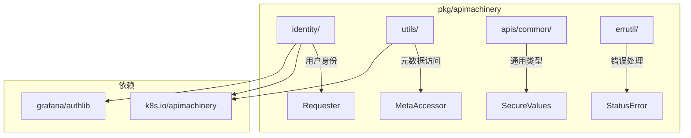

# pkg/apimachinery

`pkg/apimachinery` 是 Grafana 的 **K8s API 机制基础库**，作为独立的 Go module 存在，提供与 Kubernetes `k8s.io/apimachinery` 对应的 Grafana 扩展。

> [!NOTE]
> 这是一个**独立 module** (`github.com/grafana/grafana/pkg/apimachinery`)，可被其他项目单独引用。

## 架构概览



## 子包说明

| 子包 | 职责 |
|------|------|
| `identity/` | 请求者身份抽象（Requester 接口）|
| `utils/` | K8s 对象元数据访问器 |
| `apis/common/` | 通用 API 类型（SecureValues 等）|
| `errutil/` | 结构化错误处理 |
| `validation/` | 输入验证 |

---

## identity - 身份模块

### Requester 接口

```go
type Requester interface {
    user.Info            // K8s user.Info
    claims.AuthInfo      // Grafana AuthLib
    
    GetIdentityType() claims.IdentityType
    GetEmail() string
    GetLogin() string
    GetOrgID() int64
    GetOrgRole() RoleType
    GetPermissions() map[string][]string
    GetTeams() []int64
    GetIDToken() string
    HasRole(role RoleType) bool
}
```

**用途：** 统一表示请求发起者（用户、服务账户、API Key 等）。

### 身份类型

| 类型 | 说明 |
|------|------|
| `TypeUser` | 普通用户 |
| `TypeServiceAccount` | 服务账户 |
| `TypeAPIKey` | API Key |
| `TypeRenderService` | 渲染服务 |

---

## utils - 工具模块

### GrafanaMetaAccessor

扩展 K8s `metav1.Object` 的元数据访问器：

```go
type GrafanaMetaAccessor interface {
    metav1.Object  // 标准 K8s 元数据
    
    // Grafana 扩展
    GetFolder() string
    SetFolder(uid string)
    GetCreatedBy() string
    GetUpdatedBy() string
    GetUpdatedTimestamp() (*time.Time, error)
    GetSpec() (any, error)
    SetSpec(any) error
    FindTitle(defaultTitle string) string
    
    // 管理器属性（GitOps）
    GetManagerProperties() (ManagerProperties, bool)
    SetManagerProperties(ManagerProperties)
}
```

### Grafana 自定义注解

| 注解 Key | 用途 |
|---------|------|
| `grafana.app/createdBy` | 创建者 |
| `grafana.app/updatedBy` | 更新者 |
| `grafana.app/updatedTimestamp` | 更新时间 |
| `grafana.app/folder` | 所属文件夹 |
| `grafana.app/message` | 提交消息 |
| `grafana.app/managedBy` | 管理器类型 |
| `grafana.app/managerId` | 管理器标识 |

### 使用示例

```go
// 从任意 K8s 对象获取元数据访问器
meta, err := utils.MetaAccessor(dashboard)
if err != nil {
    return err
}

// 读取 Grafana 扩展属性
folder := meta.GetFolder()
createdBy := meta.GetCreatedBy()

// 获取 Spec
spec, _ := meta.GetSpec()
```

---

## apis/common - 通用 API 类型

### SecureValues

安全值管理，支持内联密钥和引用：

```go
type InlineSecureValues map[string]SecureValue

type SecureValue struct {
    // 明文值（仅写入时使用）
    Value *string `json:"value,omitempty"`
    // 引用（读取时返回）
    Ref *SecureRef `json:"ref,omitempty"`
}
```

---

## errutil - 错误处理

结构化错误，支持 HTTP 状态码映射：

```go
// 定义错误
var ErrNotFound = errutil.NewBase(errutil.StatusNotFound, "dashboard.not-found")

// 使用
return ErrNotFound.Errorf("dashboard %s not found", uid)
```

### 状态码

| Status | HTTP Code |
|--------|-----------|
| `StatusNotFound` | 404 |
| `StatusBadRequest` | 400 |
| `StatusUnauthorized` | 401 |
| `StatusForbidden` | 403 |
| `StatusInternal` | 500 |

---

## 文件结构

```
pkg/apimachinery/
├── go.mod                    # 独立 module
├── go.sum
├── apis/
│   └── common/v0alpha1/
│       ├── types.go          # 通用类型
│       ├── secure_values.go  # 安全值
│       └── unstructured.go   # 非结构化支持
├── identity/
│   ├── requester.go          # Requester 接口
│   ├── context.go            # Context 工具
│   ├── role_type.go          # 角色类型
│   └── static.go             # 静态身份
├── utils/
│   ├── meta.go               # GrafanaMetaAccessor
│   ├── resource.go           # 资源工具
│   ├── manager.go            # 管理器属性
│   └── blob.go               # Blob 信息
├── errutil/
│   ├── errors.go             # 结构化错误
│   ├── status.go             # HTTP 状态映射
│   └── template.go           # 错误模板
└── validation/
    └── ...                   # 验证器
```

---

## 与 K8s apimachinery 的关系

| K8s 包 | Grafana 扩展 |
|--------|-------------|
| `k8s.io/apimachinery/pkg/apis/meta/v1` | `utils.GrafanaMetaAccessor` |
| `k8s.io/apiserver/pkg/authentication/user` | `identity.Requester` |
| — | `apis/common/v0alpha1` (SecureValues) |
| — | `errutil` (结构化错误) |

---

## 设计理由

1. **独立 Module** - 可被外部项目引用，不依赖整个 Grafana
2. **扩展 K8s** - 保持 K8s 兼容性同时添加 Grafana 特有功能
3. **身份统一** - Requester 接口统一用户、服务账户、API Key
4. **GitOps 支持** - ManagerProperties 支持资源来源追踪
