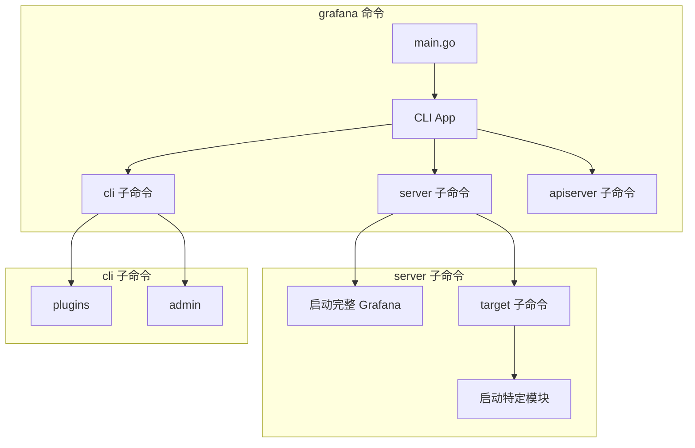

# Grafana CLI 入口

`pkg/cmd/grafana` 是 Grafana 的统一命令行入口点，整合了服务器启动、CLI 工具和 API Server 功能。

## 架构概览



## 核心入口 (`main.go`)

```go
func main() {
    app := MainApp()
    if err := app.Run(os.Args); err != nil {
        os.Exit(1)
    }
    os.Exit(0)
}
```

### 构建信息变量

通过 `-X` 链接器标志注入：

| 变量 | 描述 | 默认值 |
|------|------|--------|
| `version` | 版本号 | `9.2.0` |
| `commit` | Git commit | `NA` |
| `enterpriseCommit` | Enterprise commit | `NA` |
| `buildBranch` | 构建分支 | `main` |
| `buildstamp` | 构建时间戳 | 空 |

## 命令结构

### `grafana server`

启动完整 Grafana 服务器。

```bash
grafana server [flags]
```

**流程:**
1. 解析配置 (`setting.NewCfgFromArgs`)
2. 初始化 OpenFeature 特性标志
3. 调用 `server.Initialize()` 创建服务器
4. 监听系统信号 (SIGTERM, SIGINT, SIGHUP)
5. 调用 `server.Run()` 启动服务

**常用 Flags:**
| Flag | 描述 |
|------|------|
| `--config` | 配置文件路径 |
| `--homepath` | Grafana 安装路径 |
| `--pidfile` | PID 文件路径 |
| `--profile` | 启用 pprof 性能分析 |

### `grafana server target`

启动特定的 dskit 模块（ModuleServer）。

```bash
grafana server target [flags]
```

通过 `cfg.Target` 配置选择要启动的模块：
- `all` - 启动所有模块
- `core` - 核心 Grafana 服务
- `storage-server` - 统一存储服务
- `zanzana-server` - 授权服务

### `grafana cli`

Grafana CLI 工具。

```bash
grafana cli [global flags] command [args]
```

#### 插件管理 (`grafana cli plugins`)

| 命令 | 描述 |
|------|------|
| `install <id> [version]` | 安装插件 |
| `uninstall <id>` | 卸载插件 |
| `ls` | 列出已安装插件 |
| `update <id>` | 更新插件 |
| `update-all` | 更新所有插件 |
| `list-remote` | 列出可用插件 |
| `list-versions <id>` | 列出插件版本 |

#### 管理命令 (`grafana cli admin`)

| 命令 | 描述 |
|------|------|
| `reset-admin-password` | 重置管理员密码 |
| `data-migration encrypt-datasource-passwords` | 加密数据源密码 |
| `data-migration to-unified-storage` | 迁移至统一存储 |
| `secrets-migration re-encrypt` | 重新加密 secrets |
| `secrets-migration rollback` | 回滚 secrets 加密 |
| `secrets-consolidation consolidate` | 整合 secrets 数据密钥 |
| `flush-rbac-seed-assignment` | 清除 RBAC 种子分配 |

### `grafana apiserver` (可选)

独立 API Server 模式，由 `server.InitializeAPIServerFactory()` 提供。

#### 为什么需要 API Server 模式？

**1. 解决单体架构的扩展性问题**

传统 `grafana server` 是单体应用，所有组件耦合在一起。API Server 模式支持：
- 独立扩展 API 层
- 组件分离部署
- 无状态水平扩展

**2. Kubernetes 原生集成**

采用 K8s API 聚合（API Aggregation）模式：


- Dashboard、DataSource 等成为 K8s CRD
- 使用 `kubectl` 管理 Grafana 资源
- 与 K8s RBAC 天然集成

**3. 微服务化拆分**

支持独立部署和扩展各个组件：

| 模块 | 功能 |
|------|------|
| `storage-server` | 统一存储服务 |
| `zanzana-server` | 授权服务 |
| `frontend-server` | 前端服务 |
| `search-server` | 搜索服务 |

**4. 云原生和企业级部署**

| 需求 | API Server 如何满足 |
|------|-------------------|
| 多租户隔离 | 每个租户独立 API 实例 |
| 地理分布 | 就近部署 API 节点 |
| 高可用 | 无状态设计，轻松水平扩展 |
| 渐进式升级 | 可以只升级 API 层 |

**与 Server 模式对比：**

| 特性 | Server | API Server |
|------|--------|------------|
| Web UI | ✓ | ✗ |
| 完整后台服务 | ✓ | ✗ |
| K8s API 兼容 | 部分 | 完整 |
| 独立微服务部署 | ✗ | ✓ |
| 水平扩展 | 有限 | 无状态扩展 |

> [!NOTE]
> API Server 模式是 Grafana 从"单体应用"走向"云原生平台"的关键演进。

## 信号处理

| 信号 | 行为 |
|------|------|
| `SIGTERM` / `SIGINT` | 优雅关闭 (30s 超时) |
| `SIGHUP` | 重新加载日志配置 |

## 与其他包的关系

```
pkg/cmd/grafana/main.go
    ↓ 引用
├── pkg/cmd/grafana-cli/commands  (CLI 子命令)
├── pkg/cmd/grafana-server/commands  (Server 子命令)
├── pkg/server  (服务器核心)
└── pkg/operators  (嵌入式 Operator)
```

## 独立入口 (兼容)

为保持向后兼容，保留了独立的入口点：

| 入口 | 路径 | 功能 |
|------|------|------|
| `grafana-server` | `pkg/cmd/grafana-server/main.go` | 仅服务器 |
| `grafana-cli` | `pkg/cmd/grafana-cli/` | 仅 CLI |

## 文件结构

```
pkg/cmd/grafana/
├── main.go       # 统一入口，构建 CLI App
└── main_test.go  # 测试（验证无重复子命令）
```
