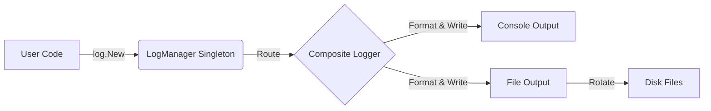

# Grafana Log Package (`pkg/infra/log`)

本文档详细说明了 Grafana 日志包的架构设计、使用方式以及未来的演进方向（Zap 迁移与新项目最佳实践）。

## 1. 架构概览 (Architecture)

Grafana 的日志系统是一个基于 **`github.com/go-kit/log`** 的自定义封装，采用“开箱即用”的 **全局单例 (Global Singleton)** 模式。

### 1.1 核心组件

*   **`LogManager` (Global)**: 全局单例管理器，负责读取配置文件（`ini`），管理文件轮转，并将日志路由到不同的输出（控制台、文件、Syslog）。
*   **`ConcreteLogger`**: 具体的 Logger 实现，持有上下文（Context）和底层 `go-kit` logger。支持 `Debug`, `Info`, `Warn`, `Error` 等标准方法。
*   **`FileLogWriter`**: 自定义实现的文件写入器，支持按大小（MaxSize）、行数（MaxLines）或日期（Daily）进行日志轮转。

### 1.2 数据流



## 2. 使用指南 (Usage)

由于采用全局单例模式，在现有代码库中使用非常简单，但隐含了全局依赖。

```go
package myservice

import "github.com/grafana/grafana/pkg/infra/log"

// 1. 获取一个具名 Logger (本质是从全局 LogManager 获取)
var logger = log.New("my.service.name")

func DoSomething() {
    // 2. 记录日志 (KV 风格)
    logger.Info("Operation started", "userId", 123, "traceId", "abc-dev")
    
    // 3. 创建带有上下文的子 Logger
    reqLogger := logger.New("requestId", "req-1")
    reqLogger.Info("Request processing") // 输出会自动带上 userId... 和 requestId...
}
```

## 3. 演进路线：迁移至 Zap (Migration to Zap)

虽然现有方案功能完备，但在性能和生态上不如现代化的 **Uber Zap**。我们已经制定了无需修改业务代码的迁移计划。

### 3.1 适配器方案 (Adapter Pattern)

目标：**保持 `pkg/infra/log` 接口不变，底层替换为 Zap**。

1.  **接口兼容**：使用 `zap.SugaredLogger` 兼容现有的 `Key-Value` 不定参数接口（`ctx ...any`）。
2.  **配置接管**：
    *   **Console**: 使用 `zapcore.ConsoleEncoder`。
    *   **File**: 使用 `zapcore.AddSync` + `natefinch/lumberjack` (因为 Zap 原生不支持文件轮转)。
3.  **收益**：
    *   **性能提升**：虽然为了兼容接口仍有内存分配，但 Zap 的底层序列化效率更高。
    *   **代码精简**：移除 `pkg/infra/log` 中复杂的自定义文件轮转代码，转而依赖成熟的 `lumberjack` 库。

详细迁移计划请参考：[ZAP_MIGRATION_PLAN.md](./ZAP_MIGRATION_PLAN.md)

## 4. 新项目/新模块最佳实践 (Best Practices for New Projects)

如果是在 Grafana 之外开启新项目，或者重构核心模块，**强烈不推荐**继续使用上述的全局单例模式。

### 黄金法则：依赖注入 + 标准库 slog

推荐使用 Go 1.21+ 标准库 **`log/slog`** 配合 **依赖注入 (Dependency Injection)**。

#### 示例代码

```go
import "log/slog"

type Service struct {
    // 显式依赖，而非全局变量
    logger *slog.Logger
}

func NewService(logger *slog.Logger) *Service {
    return &Service{
        // 绑定组件名称，日志自带 component=user_service
        logger: logger.With("component", "user_service"),
    }
}

func (s *Service) Run(ctx context.Context) {
    // 使用 Context 记录日志，自动关联 TraceID
    s.logger.InfoContext(ctx, "service running", "port", 8080)
}
```

*   **为什么？**：解耦了全局状态，单元测试时可以轻松注入 Mock Logger，且 `slog` 是 Go 官方标准，未来兼容性最好。
*   **高性能需求？**：如果在极高频路径，可以将 `slog` 的后端实现替换为 `Zap`，业务代码完全改。

详细指南请参考：[NEW_PROJECT_LOGGING_GUIDE.md](./NEW_PROJECT_LOGGING_GUIDE.md)
