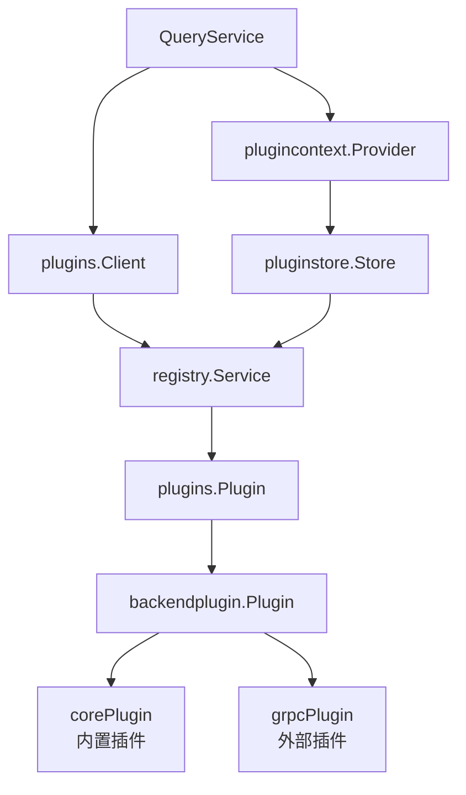

# Grafana Plugin 加载流程详解

基于 `pkg/services/query/query.go:291` (`handleQuerySingleDatasource` 方法) 的查询过程，详细解读 plugin 是如何被加载和调用的。

## 一、查询流程入口 (query.go:291)

```go
func (s *ServiceImpl) handleQuerySingleDatasource(ctx context.Context, user identity.Requester, parsedReq *parsedRequest) (*backend.QueryDataResponse, error) {
    // ...
    pCtx, err := s.pCtxProvider.GetWithDataSource(ctx, ds.Type, user, ds) // 第320行
    req.PluginContext = pCtx
    return s.pluginClient.QueryData(ctx, req) // 第325行
}
```

两个关键依赖：
1. **`pCtxProvider`** (`plugincontext.Provider`) - 提供 plugin 上下文
2. **`pluginClient`** (`plugins.Client`) - 执行实际的查询

---

## 二、核心组件层次结构



---

## 三、Plugin 加载过程

### 1. 启动时加载 (`pluginstore/store.go`)

```go
// ProvideService 在 Grafana 启动时被调用
func ProvideService(...) (*Service, error) {
    for _, ps := range pluginSources.List(ctx) {
        loadedPlugins, err := pluginLoader.Load(ctx, ps) // 加载所有插件源
    }
}
```

### 2. Loader 四阶段流水线 (`loader/loader.go:61-118`)

```go
func (l *Loader) Load(ctx context.Context, src plugins.PluginSource) ([]*plugins.Plugin, error) {
    // 阶段1: Discovery - 发现插件
    discoveredPlugins, err := l.discovery.Discover(ctx, src)
    
    // 阶段2: Bootstrap - 初始化插件元数据
    for _, foundBundle := range discoveredPlugins {
        bootstrappedPlugin, err := l.bootstrap.Bootstrap(ctx, src, foundBundle)
        bootstrappedPlugins = append(bootstrappedPlugins, bootstrappedPlugin...)
    }
    
    // 阶段3: Validation - 验证插件
    for _, bootstrappedPlugin := range bootstrappedPlugins {
        err := l.validation.Validate(ctx, bootstrappedPlugin)
        validatedPlugins = append(validatedPlugins, bootstrappedPlugin)
    }
    
    // 阶段4: Initialization - 启动插件进程
    for _, validatedPlugin := range validatedPlugins {
        initializedPlugin, err := l.initializer.Initialize(ctx, validatedPlugin)
        initializedPlugins = append(initializedPlugins, initializedPlugin)
    }
    
    return initializedPlugins, nil
}
```

### 3. 注册到 Registry (`registry/in_memory.go`)

```go
type InMemory struct {
    store map[string]*plugins.Plugin  // pluginID -> Plugin
    alias map[string]*plugins.Plugin  // 别名映射
    mu    sync.RWMutex
}

func (i *InMemory) Add(_ context.Context, p *plugins.Plugin) error {
    i.store[p.ID] = p
    for _, a := range p.AliasIDs {
        i.alias[a] = p
    }
}
```

---

## 四、运行时查询流程

### 1. Client 查询 (`manager/client/client.go:50-95`)

```go
func (s *Service) QueryData(ctx context.Context, req *backend.QueryDataRequest) (*backend.QueryDataResponse, error) {
    // 从 registry 获取 plugin
    p, exists := s.plugin(ctx, req.PluginContext.PluginID, req.PluginContext.PluginVersion)
    if !exists {
        return nil, plugins.ErrPluginNotRegistered
    }
    
    // 调用 plugin 的 QueryData 方法
    resp, err := p.QueryData(ctx, req)
    return resp, err
}
```

### 2. Plugin 查找 (`manager/client/client.go:305-317`)

```go
func (s *Service) plugin(ctx context.Context, pluginID, pluginVersion string) (*plugins.Plugin, bool) {
    p, exists := s.pluginRegistry.Plugin(ctx, pluginID, pluginVersion)
    if !exists {
        return nil, false
    }
    if p.IsDecommissioned() {
        return nil, false
    }
    return p, true
}
```

---

## 五、两种 Plugin 类型

### 1. Core Plugin (内置插件) - `backendplugin/coreplugin/core_plugin.go`

直接在进程内执行，不需要 RPC：

```go
type corePlugin struct {
    pluginID string
    backend.QueryDataHandler  // 嵌入查询处理器
    // ...
}

func (cp *corePlugin) QueryData(ctx context.Context, req *backend.QueryDataRequest) (*backend.QueryDataResponse, error) {
    if cp.QueryDataHandler != nil {
        return cp.QueryDataHandler.QueryData(ctx, req)
    }
    return nil, plugins.ErrMethodNotImplemented
}

func (cp *corePlugin) Target() backendplugin.Target {
    return backendplugin.TargetInMemory  // 内存中执行
}
```

### 2. gRPC Plugin (外部插件) - `backendplugin/grpcplugin/client.go`

使用 HashiCorp go-plugin 框架通过 gRPC 通信：

```go
var pluginSet = map[int]goplugin.PluginSet{
    grpcplugin.ProtocolVersion: {
        "diagnostics": &grpcplugin.DiagnosticsGRPCPlugin{},
        "resource":    &grpcplugin.ResourceGRPCPlugin{},
        "data":        &grpcplugin.DataGRPCPlugin{},       // 数据查询
        "stream":      &grpcplugin.StreamGRPCPlugin{},
        // ...
    },
}

// 启动外部插件进程
func newClientConfig(descriptor PluginDescriptor, ...) *goplugin.ClientConfig {
    cmd := exec.Command(executablePath, descriptor.executableArgs...)
    return &goplugin.ClientConfig{
        Cmd:              cmd,
        HandshakeConfig:  handshake,
        AllowedProtocols: []goplugin.Protocol{goplugin.ProtocolGRPC},
    }
}
```

---

## 六、完整调用链路图

```
用户查询请求
    ↓
[API Handler]
    ↓
[query.ServiceImpl.QueryData] (query.go:129)
    ↓
[query.ServiceImpl.handleQuerySingleDatasource] (query.go:291)
    ├── [pCtxProvider.GetWithDataSource] → 获取 PluginContext
    │       └── pluginStore.Plugin() → 从 registry 查找
    │
    └── [pluginClient.QueryData] (client.go:50)
            ├── s.pluginRegistry.Plugin() → 获取 *plugins.Plugin
            │
            └── p.QueryData(ctx, req) → 调用实际插件
                    ├── [corePlugin] → 内存调用
                    └── [grpcPlugin] → gRPC 调用外部进程
```

---

## 七、关键接口总结

| 接口/结构 | 文件位置 | 职责 |
|----------|---------|------|
| `plugins.Client` | `pkg/plugins/ifaces.go:111` | 与后端插件通信的客户端接口 |
| `client.Service` | `pkg/plugins/manager/client/client.go` | Client 的具体实现 |
| `registry.Service` | `pkg/plugins/manager/registry/in_memory.go` | 插件注册表（内存存储） |
| `loader.Loader` | `pkg/plugins/manager/loader/loader.go` | 插件加载器（四阶段流水线） |
| `backendplugin.Plugin` | `pkg/plugins/backendplugin/ifaces.go` | 后端插件接口 |
| `corePlugin` | `pkg/plugins/backendplugin/coreplugin/` | 内置插件实现 |
| `grpcPlugin` | `pkg/plugins/backendplugin/grpcplugin/` | 外部 gRPC 插件实现 |

---

## 八、相关源码文件

- [query.go](file:///Users/wangxiaowei1/xiaowei/grafana/pkg/services/query/query.go) - 查询服务入口
- [plugincontext.go](file:///Users/wangxiaowei1/xiaowei/grafana/pkg/services/pluginsintegration/plugincontext/plugincontext.go) - Plugin 上下文提供者
- [client.go](file:///Users/wangxiaowei1/xiaowei/grafana/pkg/plugins/manager/client/client.go) - Plugin 客户端实现
- [store.go](file:///Users/wangxiaowei1/xiaowei/grafana/pkg/services/pluginsintegration/pluginstore/store.go) - Plugin 存储服务
- [loader.go](file:///Users/wangxiaowei1/xiaowei/grafana/pkg/plugins/manager/loader/loader.go) - Plugin 加载器
- [in_memory.go](file:///Users/wangxiaowei1/xiaowei/grafana/pkg/plugins/manager/registry/in_memory.go) - Plugin 注册表
- [core_plugin.go](file:///Users/wangxiaowei1/xiaowei/grafana/pkg/plugins/backendplugin/coreplugin/core_plugin.go) - 内置插件实现
- [grpcplugin/client.go](file:///Users/wangxiaowei1/xiaowei/grafana/pkg/plugins/backendplugin/grpcplugin/client.go) - gRPC 插件实现
