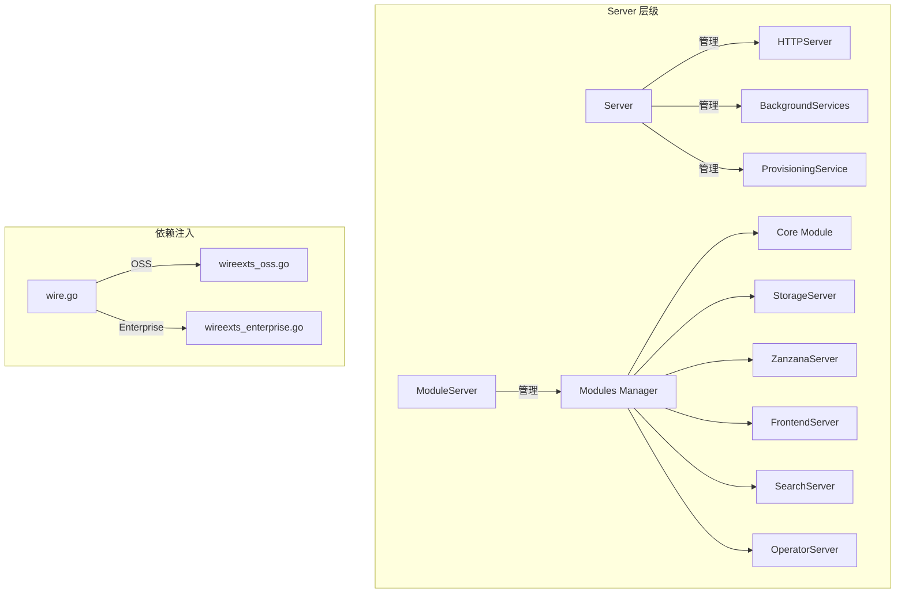

# Server Package

`pkg/server` 包定义了 Grafana 的主入口点，负责服务器生命周期管理、依赖注入和模块化服务启动。

## 架构概览



## 核心组件

### Server (`server.go`)

完整的 Grafana 服务器实现，管理所有服务的生命周期。

```go
type Server struct {
    HTTPServer          *api.HTTPServer        // HTTP API 服务
    provisioningService provisioning.ProvisioningService
    roleRegistry        accesscontrol.RoleRegistry
    backgroundServiceRegistry registry.BackgroundServiceRegistry
}
```

**主要功能:**
- `Init()` - 初始化服务器（写入 PID 文件、设置指标、注册角色）
- `Run()` - 启动所有后台服务
- `Shutdown()` - 优雅关闭服务器

### ModuleServer (`module_server.go`)

基于 [dskit](https://github.com/grafana/dskit) 的模块化服务器，支持选择性启动特定模块。

```go
type ModuleServer struct {
    features         featuremgmt.FeatureToggles
    storageBackend   resource.StorageBackend
    searchServerRing *ring.Ring  // 分布式搜索环
}
```

**注册的模块:**

| 模块 | 描述 |
|------|------|
| `Core` | 完整的 Grafana 核心服务 |
| `StorageServer` | 统一存储 gRPC 服务 |
| `ZanzanaServer` | 授权服务 |
| `FrontendServer` | 前端服务 |
| `SearchServerRing` | 分布式搜索环 |
| `SearchServerDistributor` | 搜索请求分发器 |
| `MemberlistKV` | 成员列表键值存储 |
| `OperatorServer` | Kubernetes Operator 服务 |

### Wire 依赖注入 (`wire.go`, `wireexts_oss.go`)

使用 [Google Wire](https://github.com/google/wire) 进行编译时依赖注入。

**入口函数:**

| 函数 | 用途 |
|------|------|
| `Initialize()` | 完整 Grafana 服务器 |
| `InitializeForTest()` | 测试环境 |
| `InitializeForCLI()` | CLI 命令 |
| `InitializeModuleServer()` | 模块化服务器 |
| `InitializeAPIServerFactory()` | 独立 API Server |

**Wire Set 层级:**
```
wireBasicSet (基础服务)
    ↓
wireSet (完整服务)
    ↓
wireExtsSet (OSS) / wireExtsEnterpriseSet (Enterprise)
```

> [!NOTE]
> `wire.go` 包含 OSS 和 Enterprise 共享的 wire sets。`wireexts_oss.go` 包含 OSS 特定实现，`wireexts_enterprise.go`（位于 grafana-enterprise 仓库）包含 Enterprise 特定实现。

## 分布式组件

### Ring (`ring.go`)

基于 dskit 的一致性哈希环，用于分布式搜索服务。

- 支持健康检查和重试机制
- 使用 gRPC 连接池
- 指数退避重连策略

### Memberlist (`memberlist.go`)

基于 gossip 协议的集群成员发现。

配置项:
- `MemberlistBindAddr` - 绑定地址
- `MemberlistAdvertiseAddr` - 广播地址
- `MemberlistJoinMember` - 加入的成员

## Operator 支持 (`operator.go`)

支持将 Kubernetes Operator 嵌入 Grafana 二进制文件。

```go
// 注册 operator
RegisterOperator(Operator{
    Name:        "my-operator",
    Description: "My custom operator",
    RunFunc:     func(deps OperatorDependencies) error { ... },
})
```

通过 `GF_OPERATOR_NAME` 环境变量指定要运行的 operator。

## 辅助组件

| 文件 | 描述 |
|------|------|
| `service.go` | 将 Server 包装为 dskit Service |
| `runner.go` | CLI 运行器，用于迁移等命令 |
| `module_runner.go` | 简化的模块运行器 |
| `module_registerer.go` | Enterprise 模块注册接口 |
| `instrumentation_service.go` | 监控指标 HTTP 服务 (`/metrics`) |
| `search_server_distributor.go` | 搜索请求分发服务 |
| `test_env.go` | 测试环境配置 |

## Systemd 集成

服务器支持 systemd 服务通知:

```go
s.notifySystemd("READY=1")  // 服务就绪通知
```

通过 `NOTIFY_SOCKET` 环境变量启用。

## 构建标签

| 标签 | 用途 |
|------|------|
| `wireinject` | Wire 代码生成 |
| `oss` | OSS 构建 |
| `enterprise` | Enterprise 构建 |

## 文件结构

```
pkg/server/
├── doc.go                          # 包文档
├── server.go                       # 主 Server 实现
├── module_server.go                # ModuleServer 实现
├── wire.go                         # 共享 Wire Sets
├── wireexts_oss.go                 # OSS Wire Sets
├── wire_gen.go                     # 生成的 Wire 代码
├── ring.go                         # 分布式搜索环
├── memberlist.go                   # 集群成员管理
├── service.go                      # dskit Service 包装
├── runner.go                       # CLI Runner
├── module_runner.go                # 模块 Runner
├── module_registerer.go            # 模块注册接口
├── operator.go                     # Operator 注册
├── instrumentation_service.go      # 监控服务
├── search_server_distributor.go    # 搜索分发器
└── test_env.go                     # 测试环境
```
