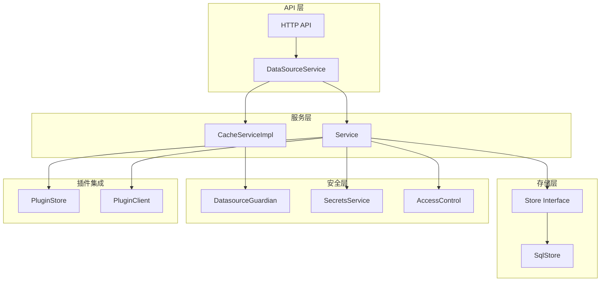

# Grafana 数据源服务 (datasources)

> 本文档详细解读 `pkg/services/datasources` 包的源代码架构与实现细节。

---

## 📁 目录结构

```
pkg/services/datasources/
├── accesscontrol.go           # 访问控制权限定义
├── datasources.go             # 核心服务接口定义
├── errors.go                  # 错误类型定义
├── models.go                  # 数据模型与命令/查询结构
├── models_test.go             # 模型单元测试
├── fakes/                     # 测试用假实现
│   ├── fake_cache_service.go
│   └── fake_datasource_service.go
├── guardian/                  # 数据源守护者（权限控制）
│   ├── allow_guardian.go
│   └── provider.go
└── service/                   # 服务层实现
    ├── cache.go               # 缓存服务实现
    ├── datasource.go          # 核心服务实现
    ├── datasource_test.go     # 服务单元测试
    ├── datasourceretriever.go # 数据源检索器
    ├── legacy.go              # 遗留查询支持
    ├── store.go               # SQL 存储层
    └── store_test.go          # 存储层单元测试
```

---

## 🎯 核心概念

### 整体架构



---

## 📋 核心接口定义

### DataSourceService 接口

位于 `datasources.go`，定义了数据源操作的核心接口：

```go
type DataSourceService interface {
    // 获取单个数据源
    GetDataSource(ctx context.Context, query *GetDataSourceQuery) (*DataSource, error)
    
    // 通过命名空间获取数据源
    GetDataSourceInNamespace(ctx context.Context, namespace, name, group string) (*DataSource, error)
    
    // 获取数据源列表
    GetDataSources(ctx context.Context, query *GetDataSourcesQuery) ([]*DataSource, error)
    
    // 获取所有数据源
    GetAllDataSources(ctx context.Context, query *GetAllDataSourcesQuery) ([]*DataSource, error)
    
    // 获取可修剪的已配置数据源
    GetPrunableProvisionedDataSources(ctx context.Context) ([]*DataSource, error)
    
    // 按类型获取数据源
    GetDataSourcesByType(ctx context.Context, query *GetDataSourcesByTypeQuery) ([]*DataSource, error)
    
    // 添加数据源
    AddDataSource(ctx context.Context, cmd *AddDataSourceCommand) (*DataSource, error)
    
    // 删除数据源
    DeleteDataSource(ctx context.Context, cmd *DeleteDataSourceCommand) error
    
    // 更新数据源
    UpdateDataSource(ctx context.Context, cmd *UpdateDataSourceCommand) (*DataSource, error)
    
    // 获取 HTTP 传输层
    GetHTTPTransport(ctx context.Context, ds *DataSource, provider httpclient.Provider, 
        customMiddlewares ...sdkhttpclient.Middleware) (http.RoundTripper, error)
    
    // 解密安全 JSON 数据
    DecryptedValues(ctx context.Context, ds *DataSource) (map[string]string, error)
    DecryptedValue(ctx context.Context, ds *DataSource, key string) (string, bool, error)
    DecryptedBasicAuthPassword(ctx context.Context, ds *DataSource) (string, error)
    DecryptedPassword(ctx context.Context, ds *DataSource) (string, error)
    
    // 获取自定义请求头
    CustomHeaders(ctx context.Context, ds *DataSource) (http.Header, error)
}
```

### CacheService 接口

提供数据源的缓存读取能力：

```go
type CacheService interface {
    // 通过数据源 ID 获取（带缓存）
    GetDatasource(ctx context.Context, datasourceID int64, user identity.Requester, skipCache bool) (*DataSource, error)
    
    // 通过数据源 UID 获取（带缓存）
    GetDatasourceByUID(ctx context.Context, datasourceUID string, user identity.Requester, skipCache bool) (*DataSource, error)
}
```

---

## 📊 数据模型

### DataSource 结构体

位于 `models.go`，核心数据结构：

```go
type DataSource struct {
    ID      int64    `json:"id,omitempty" xorm:"pk autoincr 'id'"`
    OrgID   int64    `json:"orgId,omitempty" xorm:"org_id"`
    Version int      `json:"version,omitempty"`

    Name   string   `json:"name"`
    Type   string   `json:"type"`         // 数据源类型，如 "prometheus", "mysql"
    Access DsAccess `json:"access"`       // 访问模式：proxy 或 direct
    URL    string   `json:"url" xorm:"url"`
    
    // 认证信息
    Password          string `json:"-"`
    User              string `json:"user"`
    Database          string `json:"database"`
    BasicAuth         bool   `json:"basicAuth"`
    BasicAuthUser     string `json:"basicAuthUser"`
    BasicAuthPassword string `json:"-"`
    WithCredentials   bool   `json:"withCredentials"`
    
    // 配置
    IsDefault      bool              `json:"isDefault"`
    JsonData       *simplejson.Json  `json:"jsonData"`       // 公开配置
    SecureJsonData map[string][]byte `json:"secureJsonData"` // 加密配置
    ReadOnly       bool              `json:"readOnly"`
    
    // 标识符
    UID        string `json:"uid" xorm:"uid"`
    APIVersion string `json:"apiVersion" xorm:"api_version"`
    IsPrunable bool   `xorm:"is_prunable"`
    
    // 时间戳
    Created time.Time `json:"created,omitempty"`
    Updated time.Time `json:"updated,omitempty"`
}
```

### 支持的数据源类型常量

```go
const (
    DS_ACCESS_DIRECT     = "direct"   // 直接访问模式
    DS_ACCESS_PROXY      = "proxy"    // 代理访问模式
    
    // 内置数据源类型
    DS_ALERTMANAGER      = "alertmanager"
    DS_AZURE_MONITOR     = "grafana-azure-monitor-datasource"
    DS_ES                = "elasticsearch"
    DS_GRAPHITE          = "graphite"
    DS_INFLUXDB          = "influxdb"
    DS_JAEGER            = "jaeger"
    DS_LOKI              = "loki"
    DS_MSSQL             = "mssql"
    DS_MYSQL             = "mysql"
    DS_POSTGRES          = "grafana-postgresql-datasource"
    DS_PROMETHEUS        = "prometheus"
    DS_TEMPO             = "tempo"
    DS_TESTDATA          = "grafana-testdata-datasource"
    // ... 更多类型
)
```

### 命令与查询对象

#### AddDataSourceCommand - 添加数据源命令

```go
type AddDataSourceCommand struct {
    Name            string            `json:"name"`
    Type            string            `json:"type" binding:"Required"`
    Access          DsAccess          `json:"access" binding:"Required"`
    URL             string            `json:"url"`
    User            string            `json:"user"`
    Database        string            `json:"database"`
    BasicAuth       bool              `json:"basicAuth"`
    BasicAuthUser   string            `json:"basicAuthUser"`
    WithCredentials bool              `json:"withCredentials"`
    IsDefault       bool              `json:"isDefault"`
    JsonData        *simplejson.Json  `json:"jsonData"`
    SecureJsonData  map[string]string `json:"secureJsonData"`
    UID             string            `json:"uid"`
    
    // 内部字段
    OrgID                   int64             `json:"-"`
    UserID                  int64             `json:"-"`
    ReadOnly                bool              `json:"-"`
    EncryptedSecureJsonData map[string][]byte `json:"-"`
    UpdateSecretFn          UpdateSecretFn    `json:"-"`
}
```

#### UpdateDataSourceCommand - 更新数据源命令

```go
type UpdateDataSourceCommand struct {
    // 与 AddDataSourceCommand 类似的字段...
    Version int `json:"version"` // 用于乐观锁
    
    // 特有字段
    AllowLBACRuleUpdates    bool `json:"-"` // LBAC 规则更新控制
    IgnoreOldSecureJsonData bool `json:"-"` // 是否忽略旧的安全数据
}
```

#### GetDataSourceQuery - 查询数据源

```go
type GetDataSourceQuery struct {
    ID    int64  // Deprecated: 使用 UID
    UID   string // 推荐使用
    Name  string // Deprecated: 使用 UID
    OrgID int64  // 必需
}
```

---

## 🔐 访问控制

位于 `accesscontrol.go`，定义数据源的权限系统：

### 权限动作

```go
const (
    ActionRead             = "datasources:read"              // 读取数据源配置
    ActionQuery            = "datasources:query"             // 执行查询
    ActionCreate           = "datasources:create"            // 创建数据源
    ActionWrite            = "datasources:write"             // 修改数据源
    ActionDelete           = "datasources:delete"            // 删除数据源
    ActionIDRead           = "datasources.id:read"           // 读取数据源 ID
    ActionPermissionsRead  = "datasources.permissions:read"  // 读取权限配置
    ActionPermissionsWrite = "datasources.permissions:write" // 修改权限配置
)
```

### Scope 定义

```go
const (
    ScopeRoot   = "datasources"
    ScopePrefix = ScopeRoot + ":uid:"
)

var (
    ScopeID       = accesscontrol.Scope("datasources", "id", ":datasourceId")
    ScopeAll      = accesscontrol.GetResourceAllScope(ScopeRoot)
    ScopeProvider = accesscontrol.NewScopeProvider(ScopeRoot)
)
```

### 页面访问控制

```go
// 配置页面访问
ConfigurationPageAccess = accesscontrol.EvalAny(
    accesscontrol.EvalPermission(ActionCreate),
    accesscontrol.EvalAll(
        accesscontrol.EvalPermission(ActionRead),
        accesscontrol.EvalAny(
            accesscontrol.EvalPermission(ActionDelete),
            accesscontrol.EvalPermission(ActionWrite),
        ),
    ),
)

// 新建页面访问
NewPageAccess = accesscontrol.EvalAll(
    accesscontrol.EvalPermission(ActionRead),
    accesscontrol.EvalPermission(ActionCreate),
)

// 编辑页面访问
EditPageAccess = accesscontrol.EvalAll(
    accesscontrol.EvalPermission(ActionRead),
    accesscontrol.EvalPermission(ActionWrite),
)
```

---

## ⚠️ 错误类型

位于 `errors.go`，定义标准化错误：

```go
var (
    ErrDataSourceNotFound                = errors.New("data source not found")
    ErrDataSourceNameExists              = errors.New("data source with the same name already exists")
    ErrDataSourceUidExists               = errors.New("data source with the same uid already exists")
    ErrDataSourceUpdatingOldVersion      = errors.New("trying to update old version of datasource")
    ErrDataSourceAccessDenied            = errors.New("data source access denied")
    ErrDataSourceFailedGenerateUniqueUid = errors.New("failed to generate unique datasource ID")
    ErrDataSourceIdentifierNotSet        = errors.New("unique identifier and org id are needed...")
    ErrDatasourceIsReadOnly              = errors.New("data source is readonly...")
    
    // 验证错误（使用 errutil）
    ErrDataSourceNameInvalid       = errutil.ValidationFailed("datasource.nameInvalid", ...)
    ErrDataSourceURLInvalid        = errutil.ValidationFailed("datasource.urlInvalid", ...)
    ErrDataSourceAPIVersionInvalid = errutil.ValidationFailed("datasource.apiVersionInvalid", ...)
    ErrDataSourceUIDInvalid        = errutil.ValidationFailed("datasource.uidInvalid", ...)
)
```

---

## 🏗️ 服务实现

### Service 结构体

位于 `service/datasource.go`，是核心服务实现：

```go
type Service struct {
    SQLStore                  Store                                    // SQL 存储层
    SecretsStore              kvstore.SecretsKVStore                   // 密钥存储
    SecretsService            secrets.Service                          // 加密服务
    cfg                       *setting.Cfg                             // 配置
    features                  featuremgmt.FeatureToggles               // 特性开关
    permissionsService        accesscontrol.DatasourcePermissionsService
    ac                        accesscontrol.AccessControl              // 访问控制
    logger                    log.Logger
    db                        db.DB
    pluginStore               pluginstore.Store                        // 插件存储
    pluginClient              plugins.Client                           // 插件客户端
    basePluginContextProvider plugincontext.BasePluginContextProvider  // 插件上下文提供者
    retriever                 DataSourceRetriever                      // 数据源检索器
    
    ptc proxyTransportCache  // HTTP 传输层缓存
}
```

### 依赖注入 Provider

```go
func ProvideService(
    db db.DB, 
    secretsService secrets.Service, 
    secretsStore kvstore.SecretsKVStore, 
    cfg *setting.Cfg,
    features featuremgmt.FeatureToggles, 
    ac accesscontrol.AccessControl, 
    datasourcePermissionsService accesscontrol.DatasourcePermissionsService,
    quotaService quota.Service, 
    pluginStore pluginstore.Store, 
    pluginClient plugins.Client,
    basePluginContextProvider plugincontext.BasePluginContextProvider,
    retriever DataSourceRetriever,
) (*Service, error)
```

### DataSourceRetriever 抽象

`DataSourceRetriever` 接口的引入主要为了解决 **循环依赖 (Circular Dependencies)** 和提供 **接口抽象**。

1.  **解决循环依赖**：
    - `DatasourceService` 依赖 `AccessControl` 进行权限检查。
    - `AccessControl` 的 `ScopeAttributeResolver` 需要查询数据源信息来解析 Scope（例如将 Name 解析为 UID）。
    - 如果 Resolver 直接依赖 `DatasourceService`，就会形成 `Service -> AccessControl -> Service` 的循环依赖。
    - 通过引入 `DataSourceRetriever`，Resolver 只依赖该接口（通常由 `SqlStore` 实现），从而打破循环。

2.  **接口定义**：

```go
// DataSourceRetriever interface for retrieving a datasource.
type DataSourceRetriever interface {
	GetDataSource(ctx context.Context, query *datasources.GetDataSourceQuery) (*datasources.DataSource, error)
	GetDataSourceInNamespace(ctx context.Context, namespace, name, group string) (*datasources.DataSource, error)
}
```

### 核心方法实现

#### 添加数据源

```go
func (s *Service) AddDataSource(ctx context.Context, cmd *datasources.AddDataSourceCommand) (*datasources.DataSource, error) {
    // 1. 检查是否需要设为默认（第一个数据源自动设为默认）
    dataSources, err := s.SQLStore.GetDataSources(ctx, &datasources.GetDataSourcesQuery{OrgID: cmd.OrgID})
    if len(dataSources) == 0 {
        cmd.IsDefault = true
    }
    
    // 2. 自动生成名称（如果未提供）
    if cmd.Name == "" {
        cmd.Name = getAvailableName(cmd.Type, dataSources)
    }
    
    // 3. 验证并准备实例设置（调用插件验证）
    settings, err := s.prepareInstanceSettings(ctx, &backend.DataSourceInstanceSettings{...}, nil)
    
    // 4. 在事务中执行：加密、保存、设置权限
    err = s.db.InTransaction(ctx, func(ctx context.Context) error {
        // 加密敏感数据
        cmd.EncryptedSecureJsonData, err = s.SecretsService.EncryptJsonData(ctx, cmd.SecureJsonData, ...)
        
        // 保存到数据库
        dataSource, err = s.SQLStore.AddDataSource(ctx, cmd)
        
        // 设置初始权限
        if s.cfg.RBAC.PermissionsOnCreation("datasource") {
            s.permissionsService.SetPermissions(ctx, cmd.OrgID, dataSource.UID, ...)
        }
        return nil
    })
    
    return dataSource, nil
}
```

#### 更新数据源

```go
func (s *Service) UpdateDataSource(ctx context.Context, cmd *datasources.UpdateDataSourceCommand) (*datasources.DataSource, error) {
    return dataSource, s.db.InTransaction(ctx, func(ctx context.Context) error {
        // 1. 获取现有数据源
        dataSource, err = s.SQLStore.GetDataSource(ctx, query)
        
        // 2. 验证设置（调用插件验证）
        settings, err := s.prepareInstanceSettings(ctx, ..., dataSource)
        
        // 3. 保留现有 LBAC 规则
        if !cmd.AllowLBACRuleUpdates {
            cmd.JsonData = RetainExistingLBACRules(dataSource.JsonData, cmd.JsonData)
        }
        
        // 4. 检查名称冲突
        if cmd.Name != dataSource.Name {
            exist, _ := s.SQLStore.GetDataSource(ctx, &GetDataSourceQuery{Name: cmd.Name, OrgID: cmd.OrgID})
            if exist != nil {
                return datasources.ErrDataSourceNameExists
            }
        }
        
        // 5. 填充安全 JSON 数据并更新
        err = s.fillWithSecureJSONData(ctx, cmd, dataSource)
        dataSource, err = s.SQLStore.UpdateDataSource(ctx, cmd)
        return err
    })
}
```

#### 插件验证（Admission Control）

```go
func (s *Service) prepareInstanceSettings(ctx context.Context, 
    settings *backend.DataSourceInstanceSettings, 
    ds *datasources.DataSource) (*backend.DataSourceInstanceSettings, error) {
    
    // 1. 全局验证规则
    if len(settings.Name) > maxDatasourceNameLen {
        return nil, datasources.ErrDataSourceNameInvalid.Errorf("max length is %d", maxDatasourceNameLen)
    }
    
    // 2. 检查插件是否存在
    p, found := s.pluginStore.Plugin(ctx, settings.Type)
    if !found {
        return settings, nil  // 忽略不存在的插件
    }
    
    // 3. 如果设置了 APIVersion，调用插件验证
    if settings.APIVersion != "" {
        // 调用 ValidateAdmission
        rsp, err := s.pluginClient.ValidateAdmission(ctx, req)
        
        // 调用 MutateAdmission
        rsp, err = s.pluginClient.MutateAdmission(ctx, req)
        
        // 返回可能被插件修改过的设置
        return backend.DataSourceInstanceSettingsFromProto(rsp.ObjectBytes, ...)
    }
    
    return settings, nil
}
```

---

## 💾 存储层

### Store 接口

位于 `service/store.go`：

```go
type Store interface {
    GetDataSource(context.Context, *datasources.GetDataSourceQuery) (*datasources.DataSource, error)
    GetDataSourceInNamespace(context.Context, string, string, string) (*datasources.DataSource, error)
    GetDataSources(context.Context, *datasources.GetDataSourcesQuery) ([]*datasources.DataSource, error)
    GetDataSourcesByType(context.Context, *datasources.GetDataSourcesByTypeQuery) ([]*datasources.DataSource, error)
    DeleteDataSource(context.Context, *datasources.DeleteDataSourceCommand) error
    AddDataSource(context.Context, *datasources.AddDataSourceCommand) (*datasources.DataSource, error)
    UpdateDataSource(context.Context, *datasources.UpdateDataSourceCommand) (*datasources.DataSource, error)
    GetAllDataSources(ctx context.Context, query *datasources.GetAllDataSourcesQuery) ([]*datasources.DataSource, error)
    GetPrunableProvisionedDataSources(ctx context.Context) ([]*datasources.DataSource, error)
    Count(context.Context, *quota.ScopeParameters) (*quota.Map, error)
}
```

### SqlStore 实现

```go
type SqlStore struct {
    db       db.DB
    logger   log.Logger
    features featuremgmt.FeatureToggles
}
```

#### 关键方法

**GetDataSource** - 查询单个数据源：
```go
func (ss *SqlStore) GetDataSource(ctx context.Context, query *datasources.GetDataSourceQuery) (*datasources.DataSource, error) {
    // 验证查询参数
    if query.OrgID == 0 || (query.ID == 0 && query.Name == "" && query.UID == "") {
        return nil, datasources.ErrDataSourceIdentifierNotSet
    }
    
    // 执行查询
    datasource := &datasources.DataSource{
        OrgID: query.OrgID,
        UID:   query.UID,
        Name:  query.Name,
        ID:    query.ID,
    }
    has, err := sess.Get(datasource)
    if !has {
        return nil, datasources.ErrDataSourceNotFound
    }
    return datasource, nil
}
```

**AddDataSource** - 添加数据源：
```go
func (ss *SqlStore) AddDataSource(ctx context.Context, cmd *datasources.AddDataSourceCommand) (*datasources.DataSource, error) {
    return ds, ss.db.WithTransactionalDbSession(ctx, func(sess *db.Session) error {
        // 检查名称重复
        existing := datasources.DataSource{OrgID: cmd.OrgID, Name: cmd.Name}
        if has, _ := sess.Get(&existing); has {
            return datasources.ErrDataSourceNameExists
        }
        
        // 生成 UID
        if cmd.UID == "" {
            cmd.UID, err = generateNewDatasourceUid(sess, cmd.OrgID)
        }
        
        // 创建数据源
        ds = &datasources.DataSource{...}
        _, err = sess.Insert(ds)
        
        // 更新默认标志
        if ds.IsDefault {
            sess.Exec("UPDATE data_source SET is_default=? WHERE org_id=? AND id <> ?", false, ds.OrgID, ds.ID)
        }
        
        return nil
    })
}
```

**乐观锁更新**：
```go
func (ss *SqlStore) UpdateDataSource(ctx context.Context, cmd *datasources.UpdateDataSourceCommand) (*datasources.DataSource, error) {
    // 使用版本号进行乐观锁控制
    var updateSession *xorm.Session
    if cmd.Version != 0 {
        updateSession = sess.Where("id=? and org_id=? and version < ?", ds.ID, ds.OrgID, ds.Version)
    } else {
        updateSession = sess.Where("id=? and org_id=?", ds.ID, ds.OrgID)
    }
    
    affected, err := updateSession.Update(ds)
    if affected == 0 {
        return datasources.ErrDataSourceUpdatingOldVersion
    }
}
```

---

## 🔄 缓存服务

位于 `service/cache.go`：

```go
type CacheServiceImpl struct {
    logger       log.Logger
    cacheTTL     time.Duration         // 默认 5 秒
    CacheService *localcache.CacheService
    SQLStore     db.DB
    dsGuardian   guardian.DatasourceGuardianProvider
}
```

### 缓存策略

```go
func (dc *CacheServiceImpl) GetDatasource(ctx context.Context, datasourceID int64, 
    user identity.Requester, skipCache bool) (*datasources.DataSource, error) {
    
    cacheKey := idKey(datasourceID)  // 格式: "ds-{id}"
    
    // 1. 尝试从缓存获取
    if !skipCache {
        if cached, found := dc.CacheService.Get(cacheKey); found {
            ds := cached.(*datasources.DataSource)
            if ds.OrgID == user.GetOrgID() {
                // 检查查询权限
                if err := dc.canQuery(user, ds); err != nil {
                    return nil, err
                }
                return ds, nil
            }
        }
    }
    
    // 2. 从数据库查询
    ds, err := ss.GetDataSource(ctx, query)
    
    // 3. 同时缓存 ID 和 UID 两个键
    dc.CacheService.Set(uidKey(ds.OrgID, ds.UID), ds, dc.cacheTTL)
    dc.CacheService.Set(cacheKey, ds, dc.cacheTTL)
    
    // 4. 检查权限
    if err = dc.canQuery(user, ds); err != nil {
        return nil, err
    }
    
    return ds, nil
}
```

### 缓存键格式

```go
func idKey(id int64) string {
    return fmt.Sprintf("ds-%d", id)
}

func uidKey(orgID int64, uid string) string {
    return fmt.Sprintf("ds-orgid-uid-%d-%s", orgID, uid)
}
```

---

## 🛡️ Guardian（守护者）

位于 `guardian/` 目录，实现数据源级别的权限控制：

### 接口定义

```go
type DatasourceGuardianProvider interface {
    New(orgID int64, user identity.Requester, dataSources ...datasources.DataSource) DatasourceGuardian
}

type DatasourceGuardian interface {
    // 检查是否可以查询指定数据源
    CanQuery(datasourceID int64) (bool, error)
    
    // 按读取权限过滤数据源
    FilterDatasourcesByReadPermissions([]*datasources.DataSource) ([]*datasources.DataSource, error)
    
    // 按查询权限过滤数据源
    FilterDatasourcesByQueryPermissions([]*datasources.DataSource) ([]*datasources.DataSource, error)
}
```

### OSS 实现（AllowGuardian）

开源版本默认允许所有操作：

```go
// AllowGuardian 用于没有企业许可证的情况
// 允许所有用户查询所有数据源，不进行过滤
type AllowGuardian struct{}

func (n AllowGuardian) CanQuery(datasourceID int64) (bool, error) {
    return true, nil
}

func (n AllowGuardian) FilterDatasourcesByReadPermissions(ds []*datasources.DataSource) ([]*datasources.DataSource, error) {
    return ds, nil  // 不过滤
}

func (n AllowGuardian) FilterDatasourcesByQueryPermissions(ds []*datasources.DataSource) ([]*datasources.DataSource, error) {
    return ds, nil  // 不过滤
}
```

---

## 🔧 HTTP 传输层

### 传输层缓存

```go
type proxyTransportCache struct {
    cache map[int64]cachedRoundTripper
    sync.Mutex
}

type cachedRoundTripper struct {
    updated      time.Time
    roundTripper http.RoundTripper
}
```

### 获取 HTTP 传输层

```go
func (s *Service) GetHTTPTransport(ctx context.Context, ds *datasources.DataSource, 
    provider httpclient.Provider, customMiddlewares ...sdkhttpclient.Middleware) (http.RoundTripper, error) {
    
    s.ptc.Lock()
    defer s.ptc.Unlock()
    
    // 检查缓存（基于 ID 和更新时间）
    if t, present := s.ptc.cache[ds.ID]; present && ds.Updated.Equal(t.updated) {
        return t.roundTripper, nil
    }
    
    // 构建 HTTP 客户端选项
    opts, err := s.httpClientOptions(ctx, ds)
    opts.Middlewares = append(opts.Middlewares, customMiddlewares...)
    
    // 创建传输层
    rt, err := provider.GetTransport(*opts)
    
    // 缓存传输层
    s.ptc.cache[ds.ID] = cachedRoundTripper{
        roundTripper: rt,
        updated:      ds.Updated,
    }
    
    return rt, nil
}
```

### HTTP 客户端选项

```go
func (s *Service) httpClientOptions(ctx context.Context, ds *datasources.DataSource) (*sdkhttpclient.Options, error) {
    opts := &sdkhttpclient.Options{
        Timeouts: timeouts,
        Header:   s.getCustomHeaders(ds.JsonData, decryptedValues),
        Labels: map[string]string{
            "datasource_type": ds.Type,
            "datasource_name": ds.Name,
            "datasource_uid":  ds.UID,
        },
        TLS: &tlsOptions,
    }
    
    // 基本认证
    if ds.BasicAuth {
        opts.BasicAuth = &sdkhttpclient.BasicAuthOptions{...}
    }
    
    // Secure Socks DS Proxy
    if ds.IsSecureSocksDSProxyEnabled() {
        opts.ProxyOptions = &sdkproxy.Options{...}
    }
    
    // AWS SigV4 认证
    if ds.JsonData.Get("sigV4Auth").MustBool(false) && s.cfg.SigV4AuthEnabled {
        opts.SigV4 = &sdkhttpclient.SigV4Config{...}
    }
    
    return opts, nil
}
```

---

## 🧪 测试支持

### Fake 实现

#### FakeDataSourceService

```go
type FakeDataSourceService struct {
    lastID                int64
    DataSources           []*datasources.DataSource
    SimulatePluginFailure bool
    DataSourceHeaders     map[string]http.Header
}
```

#### FakeCacheService

```go
type FakeCacheService struct {
    DataSources []*datasources.DataSource
}
```

使用示例：
```go
func TestSomething(t *testing.T) {
    fakeService := &FakeDataSourceService{
        DataSources: []*datasources.DataSource{
            {ID: 1, UID: "test-ds", Type: "prometheus", OrgID: 1},
        },
    }
    
    ds, err := fakeService.GetDataSource(ctx, &GetDataSourceQuery{UID: "test-ds"})
}
```

---

## 📈 配额管理

数据源支持 Grafana 的配额系统：

```go
const (
    QuotaTargetSrv quota.TargetSrv = "data_source"
    QuotaTarget    quota.Target    = "data_source"
)

func (s *Service) Usage(ctx context.Context, scopeParams *quota.ScopeParameters) (*quota.Map, error) {
    return s.SQLStore.Count(ctx, scopeParams)
}
```

配额范围：
- **Global**: 全局数据源数量限制
- **Org**: 每个组织的数据源数量限制

---

## 📝 LBAC（Label-Based Access Control）

数据源支持基于标签的访问控制，用于 Prometheus/Mimir 等数据源：

### 数据结构

```go
type TeamHTTPHeaders struct {
    Headers TeamHeaders `json:"headers"`
}

type TeamHeaders map[string][]AccessRule

type AccessRule struct {
    Header   string `json:"header"`     // 请求头名称（如 X-Prom-Label-Policy）
    LBACRule string `json:"value"`      // LBAC 规则（如 "tenant:{ label=value }"）
}
```

### 规则保留

更新数据源时默认保留现有 LBAC 规则：

```go
func RetainExistingLBACRules(storedJsonData, cmdJsonData *simplejson.Json) *simplejson.Json {
    if storedJsonData == nil {
        cmdJsonData.Del("teamHttpHeaders")
        return cmdJsonData
    }
    
    previousRules := storedJsonData.Get("teamHttpHeaders").Interface()
    if previousRules != nil {
        cmdJsonData.Set("teamHttpHeaders", previousRules)
    }
    
    return cmdJsonData
}
```

---

## 🔗 遗留支持

位于 `service/legacy.go`，支持使用旧版 ID 或名称查询数据源：

```go
type LegacyDataSourceLookup interface {
    // 从废弃的字段（name 或 id）获取数据源引用
    GetDataSourceFromDeprecatedFields(ctx context.Context, name string, id int64) (*data.DataSourceRef, error)
}

type cachingLegacyDataSourceLookup struct {
    retriever DataSourceRetriever
    cache     map[string]cachedValue  // 缓存查询结果
    cacheMu   sync.Mutex
    log       log.Logger
}
```

### 兼容处理

```go
func (s *cachingLegacyDataSourceLookup) GetDataSourceFromDeprecatedFields(ctx context.Context, name string, id int64) (*data.DataSourceRef, error) {
    // 先尝试按 name 或 id 查询
    ds, err := s.retriever.GetDataSource(ctx, &datasources.GetDataSourceQuery{
        OrgID: user.GetOrgID(),
        Name:  name,
        ID:    id,
    })
    
    // 如果按 name 找不到，尝试将 name 作为 UID
    if errors.Is(err, datasources.ErrDataSourceNotFound) && name != "" {
        ds, err = s.retriever.GetDataSource(ctx, &datasources.GetDataSourceQuery{
            OrgID: user.GetOrgID(),
            UID:   name,  // name 有时实际上是 UID
        })
    }
    
    return &data.DataSourceRef{Type: ds.Type, UID: ds.UID}, err
}
```

---

## 🎛️ 配置验证

### 限制常量

```go
const (
    maxDatasourceNameLen = 190  // 名称最大长度
    maxDatasourceUrlLen  = 255  // URL 最大长度
)
```

### UID 验证

```go
// 使用 util.ValidateUID 验证 UID 格式
// 有效的 UID: a-z, A-Z, 0-9, -, _，最大长度 40
if err := util.ValidateUID(cmd.UID); err != nil {
    return datasources.ErrDataSourceUIDInvalid.Errorf("invalid UID: %w", err)
}
```

---

## 🔄 事件发布

删除数据源时发布事件：

```go
if cmd.DeletedDatasourcesCount > 0 && !cmd.SkipPublish {
    sess.PublishAfterCommit(&events.DataSourceDeleted{
        Timestamp: time.Now(),
        Name:      ds.Name,
        ID:        ds.ID,
        UID:       ds.UID,
        OrgID:     ds.OrgID,
    })
}
```

> **注意**: `SkipPublish` 用于在 provisioning 期间删除后重新创建同一 UID 的数据源时，避免触发相关资源（如 correlations）的清理。

---

## 📚 总结

`pkg/services/datasources` 包是 Grafana 数据源管理的核心：

| 组件 | 职责 |
|------|------|
| **DataSourceService** | 数据源 CRUD 操作的核心接口 |
| **CacheService** | 带权限检查的缓存读取 |
| **Store/SqlStore** | SQL 持久化层 |
| **Guardian** | 查询权限守护 |
| **Secrets** | 敏感数据加密/解密 |
| **HTTP Transport** | 为插件提供配置好的 HTTP 客户端 |

### 核心设计模式

1. **接口隔离**: 清晰分离读取（Retriever）、缓存（Cache）、完整服务（Service）
2. **事务安全**: 使用 `InTransaction` 确保操作原子性
3. **乐观锁**: 使用版本号防止并发更新冲突
4. **插件验证**: 支持插件自定义配置验证（Admission Control）
5. **分层缓存**: 内存缓存 + 权限检查避免重复数据库访问

---

*文档生成时间: 2026-02-02*
