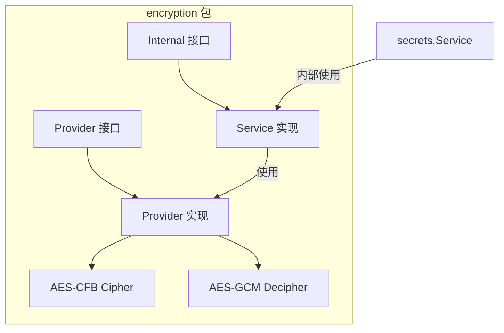
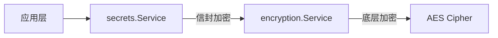

# Encryption Service

`pkg/services/encryption` 提供 Grafana 的底层加密服务，主要用于信封加密（Envelope Encryption）和遗留数据加密场景。

> [!IMPORTANT]
> 此服务**不应**用于通用加密场景。请使用 `secrets.Service` 进行一般性密钥管理。

## 架构概览



## 核心接口 (`encryption.go`)

### Internal 接口

```go
type Internal interface {
    Cipher    // Encrypt(ctx, payload, secret) ([]byte, error)
    Decipher  // Decrypt(ctx, payload, secret) ([]byte, error)
    
    EncryptJsonData(ctx, kv map[string]string, secret) (map[string][]byte, error)
    DecryptJsonData(ctx, sjd map[string][]byte, secret) (map[string]string, error)
    GetDecryptedValue(ctx, sjd, key, fallback, secret) string
}
```

### Provider 接口

```go
type Provider interface {
    ProvideCiphers() map[string]Cipher     // 加密算法提供者
    ProvideDeciphers() map[string]Decipher // 解密算法提供者
}
```

## 加密算法

| 算法 | 常量 | 加密 | 解密 | 说明 |
|------|------|:----:|:----:|------|
| AES-CFB | `aes-cfb` | ✓ | ✓ | 默认算法 |
| AES-GCM | `aes-gcm` | ✗ | ✓ | 仅解密（兼容旧数据）|

### 密钥派生

使用 PBKDF2-SHA256 将密码转换为 32 字节密钥：

```go
func KeyToBytes(secret, salt string) ([]byte, error) {
    return pbkdf2.Key(sha256.New, secret, []byte(salt), 10000, 32)
}
```

- **迭代次数**: 10,000
- **密钥长度**: 32 字节 (256-bit)
- **Salt 长度**: 8 字节

## 密文格式

加密后的密文包含算法元数据前缀：

```
*<base64(algorithm)>*<salt><iv><ciphertext>
```

| 部分 | 长度 | 说明 |
|------|------|------|
| 算法前缀 | 可变 | `*YWVzLWNmYg*` (aes-cfb) |
| Salt | 8 字节 | 随机盐值 |
| IV | 16 字节 | 初始化向量 |
| 密文 | 可变 | 加密数据 |

> [!NOTE]
> 向后兼容：无前缀的密文默认使用 AES-CFB 解密。

## Service 实现 (`service/service.go`)

### 主要功能

```go
type Service struct {
    ciphers   map[string]encryption.Cipher   // 加密器映射
    deciphers map[string]encryption.Decipher // 解密器映射
}
```

**核心方法:**

| 方法 | 功能 |
|------|------|
| `Encrypt()` | 加密数据并添加算法前缀 |
| `Decrypt()` | 解析算法前缀并解密 |
| `EncryptJsonData()` | 批量加密 JSON 字段 |
| `DecryptJsonData()` | 批量解密 JSON 字段 |
| `GetDecryptedValue()` | 解密单个值（带 fallback）|

### 配置

```ini
[security.encryption]
algorithm = aes-cfb  # 默认加密算法
```

## Provider 实现 (`provider/`)

### AES-CFB 加密 (`cipher_aescfb.go`)

```go
func (c aesCfbCipher) Encrypt(_ context.Context, payload []byte, secret string) ([]byte, error) {
    // 1. 生成随机 Salt
    // 2. 使用 PBKDF2 派生密钥
    // 3. 生成随机 IV
    // 4. AES-CFB 加密
    // 返回: salt + iv + ciphertext
}
```

### AES 解密 (`decipher_aes.go`)

支持两种模式：

| 模式 | 函数 | 特点 |
|------|------|------|
| CFB | `decryptCFB()` | 流模式，无完整性校验 |
| GCM | `decryptGCM()` | AEAD，包含完整性校验 |

## 使用示例

```go
// 注入服务
svc, _ := service.ProvideEncryptionService(tracer, provider, usage, cfg)

// 加密
encrypted, _ := svc.Encrypt(ctx, []byte("password"), secretKey)

// 解密
decrypted, _ := svc.Decrypt(ctx, encrypted, secretKey)

// JSON 数据加密
encryptedMap, _ := svc.EncryptJsonData(ctx, map[string]string{
    "username": "admin",
    "password": "secret",
}, secretKey)
```

## 文件结构

```
pkg/services/encryption/
├── encryption.go              # 接口定义、常量
├── encryption_test.go         # 基础测试
├── provider/
│   ├── provider.go            # Provider 实现
│   ├── cipher_aescfb.go       # AES-CFB 加密
│   └── decipher_aes.go        # AES-CFB/GCM 解密
└── service/
    ├── service.go             # Service 实现
    ├── service_test.go        # 服务测试
    └── helpers.go             # 辅助函数
```

## 与 secrets.Service 的关系



- **secrets.Service**: 高级 API，支持密钥轮换、多 KMS 提供商
- **encryption.Service**: 底层原语，仅负责加解密操作
