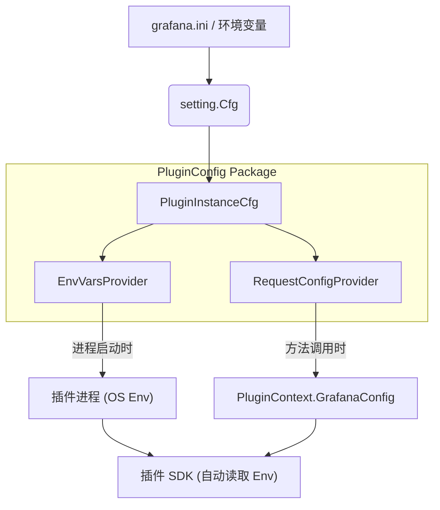

# PluginConfig 包源码分析

`pluginconfig` 包是 Grafana 插件系统的重要组成部分，负责管理和传递插件运行所需的各类配置信息。它不仅处理从 Grafana 主配置文件（g.ini）到插件的配置映射，还负责在插件进程启动时设置环境变量，以及在每次插件请求中传递动态上下文配置。

## 一、包的作用与核心职责

`pluginconfig` 的主要作用是作为 Grafana 核心与插件之间的"配置桥梁"。它确保插件能够感知到 Grafana 的运行环境、安全设置、认证信息以及功能开关。

其核心职责包括：
1.  **插件实例配置管理**：从 Grafana 全局配置中提取插件相关的部分。
2.  **环境变量注入**：在启动插件子进程时，生成并注入必要的环境变量（如 `GF_VERSION`, AWS/Azure 凭证等）。
3.  **请求上下文配置**：在处理 `CallResource`, `QueryData` 等插件请求时，动态构建并传递配置参数（如用户身份、App URL 等）。
4.  **云厂商集成**：专门处理 AWS (SigV4, Assume Role) 和 Azure (Managed Identity, SSO) 的复杂认证配置传递。

## 二、代码结构概览

```
pkg/services/pluginsintegration/pluginconfig/
├── config.go           # 定义配置结构体 (PluginInstanceCfg) 和初始化逻辑
├── request.go          # 实现 RequestConfigProvider，用于生成请求级配置
├── envvars.go          # 实现 EnvVarsProvider，用于生成进程级环境变量
├── azure_settings.go   # 处理 Azure 特定配置的合并与优先级逻辑
├── tracing.go          # OpenTelemetry 追踪配置处理
└── fakes.go            # 测试用 Mock 实现
```

## 三、核心组件详解

### 1. 配置聚合：`PluginInstanceCfg` (config.go)
这是该包的核心数据结构，存储了所有可能需要传递给插件的配置项。
- **来源**：`providePluginInstanceConfig` 函数从 `setting.Cfg` (全局配置) 和 `featuremgmt.FeatureToggles` 中提取数据。
- **内容**：包含了 Grafana 版本、App URL、AWS/Azure 设置、代理设置、SQL 连接池默认值、功能开关状态等。

### 2. 环境变量提供者：`EnvVarsProvider` (envvars.go)
负责在**启动插件进程**时计算环境变量。
- **`PluginEnvVars(ctx, plugin)`**：返回一个 `key=value` 字符串切片。
- **注入内容**：
    - **基础信息**：`GF_VERSION`, `GF_EDITION`。
    - **App 插件信息**：`GF_PLUGIN_APP_CLIENT_ID`, `GF_PLUGIN_APP_PRIVATE_KEY`。
    - **功能开关**：`GF_INSTANCE_FEATURE_TOGGLES_ENABLE`。
    - **AWS/Azure 设置**：如果配置允许转发，将云厂商凭证注入环境变量。
    - **代理设置**：`GF_PLUGIN_SECURE_SOCKS_PROXY_*`。
    - **追踪配置**：OTEL 相关变量。

### 3. 请求配置提供者：`RequestConfigProvider` (request.go)
负责在**每次插件交互**（如查询、健康检查）时生成配置 Map。这些配置会随 `backend.PluginContext` 传递给插件 SDK。
- **`PluginRequestConfig(ctx, pluginID, externalService)`**：返回 `map[string]string`。
- **传递内容**：
    - **通用**：App URL, 并发查询数限制。
    - **安全代理**：Secure Socks Proxy 的证书和地址信息。
    - **Azure 动态配置**：通过 `azure_settings.go` 合并 SSO 设置与本地配置，传递给 Azure SDK。
    - **SQL 限制**：最大行数 (`backend.SQLRowLimit`)，连接池限制。
    - **AWS SigV4**：签名认证状态。

## 四、关键流程分析

### 4.1 Azure 配置合并流程 (`azure_settings.go`)
该包对 Azure 配置有特殊处理逻辑。`mergeAzureSettings` 函数确保了配置优先级的正确性：
1.  **Config 文件 (`[azure]`)**：优先级最高（如果设置了 override）。
2.  **SSO 数据库配置**：通过 `pluginsso` 服务获取，允许 UI 动态配置。
3.  **Config 文件 (`[auth.azuread]`)**：作为基础缺省值。

### 4.2 配置传递全链路


## 五、设计模式与扩展性

- **Provider 模式**：通过接口 (`EnvVarsProvider`, `PluginRequestConfigProvider`) 隔离具体实现，便于测试和 Mock。
- **配置集中化**：所有涉及插件的杂乱配置（分散在 AWS, Azure, SQL 等不同 section）被统一收集到 `PluginInstanceCfg` 中，避免了在调用链深处依赖全局 `setting.Cfg`。
- **安全性**：敏感信息（如 Private Key, Client Secret）在传递前经过处理，且仅传递给需要的插件（通过 `AWSForwardSettingsPlugins` 等白名单控制）。
