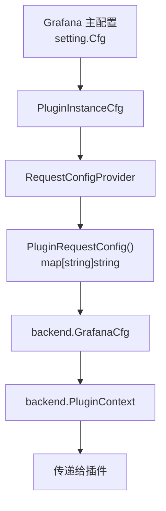

# PluginConfig 包源码分析

`pluginconfig` 包负责管理 Grafana 向插件传递的配置信息。它定义了如何将 Grafana 的全局配置转换为插件可以理解的配置格式，并在每次插件请求时传递给插件。

## 一、包结构概览

```
pluginconfig/
├── config.go           # 配置结构定义和提供者
├── request.go          # 请求配置提供者（核心）
├── envvars.go          # 环境变量配置
├── azure_settings.go   # Azure 特定配置
├── tracing.go          # 追踪配置
└── fakes.go            # 测试用 Mock
```

---

## 二、核心接口 (request.go)

### 2.1 PluginRequestConfigProvider 接口

```go
type PluginRequestConfigProvider interface {
    // 为每次插件请求生成配置 map
    PluginRequestConfig(ctx context.Context, pluginID string, externalService *auth.ExternalService) map[string]string
}
```

**调用位置**：在 `base_plugincontext.go` 中被调用：

```go
// base_plugincontext.go:52-53
settings := p.pluginRequestConfigProvider.PluginRequestConfig(ctx, plugin.ID, plugin.ExternalService)
pCtx.GrafanaConfig = backend.NewGrafanaCfg(settings)
```

### 2.2 RequestConfigProvider 结构

```go
type RequestConfigProvider struct {
    cfg         *PluginInstanceCfg       // 插件实例配置
    ssoSettings pluginsso.SettingsProvider  // SSO 设置提供者
    logger      log.Logger
}
```

---

## 三、PluginRequestConfig 方法详解 (request.go:44-204)

此方法是包的核心，负责将 Grafana 配置转换为 `map[string]string` 传递给插件。

### 3.1 基础配置

```go
func (s *RequestConfigProvider) PluginRequestConfig(ctx context.Context, pluginID string, externalService *auth.ExternalService) map[string]string {
    m := make(map[string]string)

    // Grafana 应用 URL
    if s.cfg.GrafanaAppURL != "" {
        m[backend.AppURL] = s.cfg.GrafanaAppURL
    }
    
    // 并发查询数
    if s.cfg.ConcurrentQueryCount != 0 {
        m[backend.ConcurrentQueryCount] = strconv.Itoa(s.cfg.ConcurrentQueryCount)
    }
    
    // ...
}
```

### 3.2 Feature Toggles（功能开关）

```go
// 获取所有启用的功能开关
enabledFeatures := s.cfg.Features.GetEnabled(ctx)
if len(enabledFeatures) > 0 {
    features := make([]string, 0, len(enabledFeatures))
    for feat := range enabledFeatures {
        features = append(features, feat)
    }
    sort.Strings(features)
    m[featuretoggles.EnabledFeatures] = strings.Join(features, ",")
}
```

### 3.3 AWS 配置

针对特定的 AWS 相关插件转发 AWS 配置：

```go
if slices.Contains(s.cfg.AWSForwardSettingsPlugins, pluginID) {
    if !s.cfg.AWSAssumeRoleEnabled {
        m[awsds.AssumeRoleEnabledEnvVarKeyName] = "false"
    }
    if len(s.cfg.AWSAllowedAuthProviders) > 0 {
        m[awsds.AllowedAuthProvidersEnvVarKeyName] = strings.Join(s.cfg.AWSAllowedAuthProviders, ",")
    }
    if s.cfg.AWSExternalId != "" {
        m[awsds.GrafanaAssumeRoleExternalIdKeyName] = s.cfg.AWSExternalId
    }
    if s.cfg.AWSSessionDuration != "" {
        m[awsds.SessionDurationEnvVarKeyName] = s.cfg.AWSSessionDuration
    }
    // ...
}
```

### 3.4 代理配置 (Secure SOCKS Proxy)

```go
if s.cfg.ProxySettings.Enabled {
    m[proxy.PluginSecureSocksProxyEnabled] = "true"
    m[proxy.PluginSecureSocksProxyClientCert] = s.cfg.ProxySettings.ClientCertFilePath
    m[proxy.PluginSecureSocksProxyClientKey] = s.cfg.ProxySettings.ClientKeyFilePath
    m[proxy.PluginSecureSocksProxyRootCAs] = strings.Join(s.cfg.ProxySettings.RootCAFilePaths, " ")
    m[proxy.PluginSecureSocksProxyProxyAddress] = s.cfg.ProxySettings.ProxyAddress
    m[proxy.PluginSecureSocksProxyServerName] = s.cfg.ProxySettings.ServerName
    m[proxy.PluginSecureSocksProxyAllowInsecure] = strconv.FormatBool(s.cfg.ProxySettings.AllowInsecure)
}
```

### 3.5 Azure 配置

针对支持 Azure 的插件，转发完整的 Azure 认证配置：

```go
if slices.Contains(azureSettings.ForwardSettingsPlugins, pluginID) {
    // 托管身份
    if azureSettings.ManagedIdentityEnabled {
        m[azsettings.ManagedIdentityEnabled] = "true"
        m[azsettings.ManagedIdentityClientID] = azureSettings.ManagedIdentityClientId
    }
    
    // 用户身份
    if azureSettings.UserIdentityEnabled {
        m[azsettings.UserIdentityEnabled] = "true"
        m[azsettings.UserIdentityTokenURL] = azureSettings.UserIdentityTokenEndpoint.TokenUrl
        m[azsettings.UserIdentityClientID] = azureSettings.UserIdentityTokenEndpoint.ClientId
        // ...
    }
    
    // 工作负载身份
    if azureSettings.WorkloadIdentityEnabled {
        m[azsettings.WorkloadIdentityEnabled] = "true"
        // ...
    }
}
```

### 3.6 SQL 数据源配置

```go
// 行数限制
if s.cfg.DataProxyRowLimit != 0 {
    m[backend.SQLRowLimit] = strconv.FormatInt(s.cfg.DataProxyRowLimit, 10)
}

// 连接池配置
m[backend.SQLMaxOpenConnsDefault] = strconv.Itoa(s.cfg.SQLDatasourceMaxOpenConnsDefault)
m[backend.SQLMaxIdleConnsDefault] = strconv.Itoa(s.cfg.SQLDatasourceMaxIdleConnsDefault)
m[backend.SQLMaxConnLifetimeSecondsDefault] = strconv.Itoa(s.cfg.SQLDatasourceMaxConnLifetimeDefault)
```

### 3.7 外部服务认证

```go
// App 插件的客户端密钥
if externalService != nil {
    m[backend.AppClientSecret] = externalService.ClientSecret
}
```

---

## 四、配置结构 (config.go)

### 4.1 PluginInstanceCfg - 插件实例配置

```go
type PluginInstanceCfg struct {
    // 基础配置
    GrafanaAppURL  string
    Features       featuremgmt.FeatureToggles
    GrafanaVersion string
    
    // 追踪配置
    Tracing config.Tracing
    
    // 插件特定设置
    PluginSettings config.PluginSettings
    
    // AWS 配置
    AWSAllowedAuthProviders   []string
    AWSAssumeRoleEnabled      bool
    AWSExternalId             string
    AWSSessionDuration        string
    AWSListMetricsPageLimit   string
    AWSForwardSettingsPlugins []string
    
    // Azure 配置
    Azure            *azsettings.AzureSettings
    AzureAuthEnabled bool
    
    // 代理配置
    ProxySettings setting.SecureSocksDSProxySettings
    
    // 查询配置
    ConcurrentQueryCount int
    ResponseLimit        int64
    DataProxyRowLimit    int64
    
    // SQL 数据源配置
    SQLDatasourceMaxOpenConnsDefault    int
    SQLDatasourceMaxIdleConnsDefault    int
    SQLDatasourceMaxConnLifetimeDefault int
    
    // AWS SigV4 配置
    SigV4AuthEnabled    bool
    SigV4VerboseLogging bool
    
    // 其他
    UserFacingDefaultError string
    LiveClientQueueMaxSize int
}
```

### 4.2 配置提供函数

```go
func ProvidePluginInstanceConfig(cfg *setting.Cfg, settingProvider setting.Provider, features featuremgmt.FeatureToggles) (*PluginInstanceCfg, error) {
    // 从 Grafana 主配置中提取插件需要的配置
    return &PluginInstanceCfg{
        GrafanaAppURL:             cfg.AppURL,
        Features:                  features,
        AWSAllowedAuthProviders:   allowedAuth,
        AWSAssumeRoleEnabled:      aws.KeyValue("assume_role_enabled").MustBool(),
        Azure:                     cfg.Azure,
        ProxySettings:             cfg.SecureSocksDSProxy,
        // ...
    }, nil
}
```

---

## 五、配置传递流程



---

## 六、配置键值说明

| 配置键 | 说明 | 来源 |
|-------|------|------|
| `backend.AppURL` | Grafana 应用 URL | GrafanaAppURL |
| `backend.ConcurrentQueryCount` | 并发查询数 | ConcurrentQueryCount |
| `featuretoggles.EnabledFeatures` | 启用的功能开关 | Features |
| `backend.SQLRowLimit` | SQL 行数限制 | DataProxyRowLimit |
| `backend.SQLMaxOpenConnsDefault` | SQL 最大连接数 | SQLDatasourceMaxOpenConnsDefault |
| `backend.UserFacingDefaultError` | 默认错误信息 | UserFacingDefaultError |
| `backend.ResponseLimit` | 响应大小限制 | ResponseLimit |
| `backend.AppClientSecret` | App 客户端密钥 | ExternalService |
| `proxy.*` | 代理配置 | ProxySettings |
| `awsds.*` | AWS 配置 | AWS* 字段 |
| `azsettings.*` | Azure 配置 | Azure 字段 |

---

## 七、与 PluginContext 的关联

```go
// base_plugincontext.go:42-62
func (p *BaseProvider) GetBasePluginContext(ctx context.Context, plugin pluginstore.Plugin, user identity.Requester) backend.PluginContext {
    pCtx := backend.PluginContext{
        PluginID:      plugin.ID,
        PluginVersion: plugin.Info.Version,
    }
    
    // 获取插件请求配置
    settings := p.pluginRequestConfigProvider.PluginRequestConfig(ctx, plugin.ID, plugin.ExternalService)
    
    // 转换为 GrafanaCfg
    pCtx.GrafanaConfig = backend.NewGrafanaCfg(settings)
    
    return pCtx
}
```

---

## 八、插件如何读取配置

在插件端，可以通过 `backend.PluginContext.GrafanaConfig` 读取这些配置：

```go
// 插件代码示例
func (d *Datasource) QueryData(ctx context.Context, req *backend.QueryDataRequest) (*backend.QueryDataResponse, error) {
    // 读取 Grafana 配置
    cfg := req.PluginContext.GrafanaConfig
    
    // 获取特定配置
    appURL := cfg.Get(backend.AppURL)
    rowLimit := cfg.Get(backend.SQLRowLimit)
    
    // ...
}
```

---

## 九、相关源码文件

| 文件 | 说明 |
|-----|------|
| [request.go](file:///Users/wangxiaowei1/xiaowei/grafana/pkg/services/pluginsintegration/pluginconfig/request.go) | 请求配置提供者（核心） |
| [config.go](file:///Users/wangxiaowei1/xiaowei/grafana/pkg/services/pluginsintegration/pluginconfig/config.go) | 配置结构定义 |
| [envvars.go](file:///Users/wangxiaowei1/xiaowei/grafana/pkg/services/pluginsintegration/pluginconfig/envvars.go) | 环境变量配置 |
| [azure_settings.go](file:///Users/wangxiaowei1/xiaowei/grafana/pkg/services/pluginsintegration/pluginconfig/azure_settings.go) | Azure 配置合并 |
| [base_plugincontext.go](file:///Users/wangxiaowei1/xiaowei/grafana/pkg/services/pluginsintegration/plugincontext/base_plugincontext.go) | 调用方 |
