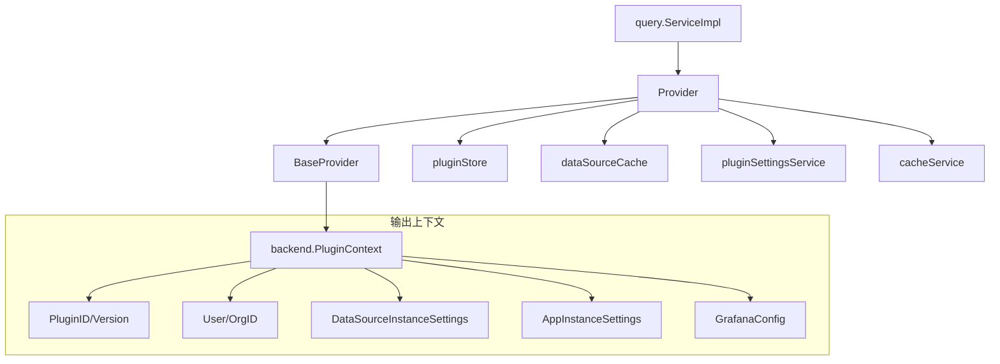

# PluginContext 包源码分析

`plugincontext` 包负责为 Grafana 插件提供执行上下文（`backend.PluginContext`）。当查询服务需要调用插件时，必须先通过此包构建包含用户信息、数据源配置、应用设置等完整上下文。

## 一、核心架构



---

## 二、核心文件结构

| 文件 | 职责 |
|-----|------|
| `base_plugincontext.go` | 基础上下文提供者，构建插件的基本信息 |
| `plugincontext.go` | 完整上下文提供者，添加数据源/应用实例设置 |

---

## 三、BaseProvider 详解

### 3.1 结构定义

```go
// base_plugincontext.go:36-40
type BaseProvider struct {
    cfg                         *setting.Cfg     // Grafana 全局配置
    pluginRequestConfigProvider pluginconfig.PluginRequestConfigProvider // 插件请求配置
    logger                      log.Logger
}
```

### 3.2 核心方法 - GetBasePluginContext

```go
// base_plugincontext.go:42-62
func (p *BaseProvider) GetBasePluginContext(ctx context.Context, plugin pluginstore.Plugin, user identity.Requester) backend.PluginContext {
    // 1. 基础信息
    pCtx := backend.PluginContext{
        PluginID:      plugin.ID,       // 插件ID，如 "prometheus"
        PluginVersion: plugin.Info.Version,  // 版本号
    }
    
    // 2. 用户信息（可选）
    if user != nil && !user.IsNil() {
        pCtx.OrgID = user.GetOrgID()  // 组织ID
        pCtx.User = adapters.BackendUserFromSignedInUser(user)  // 用户详情
    }

    // 3. Grafana 配置
    settings := p.pluginRequestConfigProvider.PluginRequestConfig(ctx, plugin.ID, plugin.ExternalService)
    pCtx.GrafanaConfig = backend.NewGrafanaCfg(settings)

    // 4. User Agent
    ua, _ := useragent.New(p.cfg.BuildVersion, runtime.GOOS, runtime.GOARCH)
    pCtx.UserAgent = ua

    return pCtx
}
```

**关键点**：
- 设置 `PluginID` 和 `PluginVersion` 用于插件识别
- 从 `identity.Requester` 提取用户信息转换为 `backend.User`
- 注入 `GrafanaConfig` 供插件读取 Grafana 配置

---

## 四、Provider 详解

### 4.1 结构定义

```go
// plugincontext.go:43-51
type Provider struct {
    *BaseProvider                           // 继承基础提供者
    cacheService          *localcache.CacheService   // 本地缓存
    pluginStore           pluginstore.Store          // 插件存储
    dataSourceCache       datasources.CacheService   // 数据源缓存
    dataSourceService     datasources.DataSourceService // 数据源服务
    pluginSettingsService pluginsettings.Service     // 插件设置服务
    logger                log.Logger
}
```

### 4.2 核心方法 - GetWithDataSource

**用途**：为数据源插件请求提供上下文（最常用）

```go
// plugincontext.go:79-94
func (p *Provider) GetWithDataSource(ctx context.Context, pluginID string, user identity.Requester, ds *datasources.DataSource) (backend.PluginContext, error) {
    // 1. 验证插件存在
    plugin, exists := p.pluginStore.Plugin(ctx, pluginID)
    if !exists {
        return backend.PluginContext{}, plugins.ErrPluginNotRegistered
    }

    // 2. 获取基础上下文
    pCtx := p.GetBasePluginContext(ctx, plugin, user)

    // 3. 转换数据源模型为插件SDK格式
    datasourceSettings, err := adapters.ModelToInstanceSettings(ds, p.decryptSecureJsonDataFn(ctx))
    if err != nil {
        return pCtx, err
    }
    
    // 4. 附加数据源实例设置
    pCtx.DataSourceInstanceSettings = datasourceSettings

    return pCtx, nil
}
```

**与 query.go:320 的关联**：
```go
// pkg/services/query/query.go:320
pCtx, err := s.pCtxProvider.GetWithDataSource(ctx, ds.Type, user, ds)
```

### 4.3 核心方法 - Get

**用途**：为 App 插件请求提供上下文

```go
// plugincontext.go:57-73
func (p *Provider) Get(ctx context.Context, pluginID string, user identity.Requester, orgID int64) (backend.PluginContext, error) {
    plugin, exists := p.pluginStore.Plugin(ctx, pluginID)
    if !exists {
        return backend.PluginContext{}, plugins.ErrPluginNotRegistered
    }

    pCtx := p.GetBasePluginContext(ctx, plugin, user)
    
    // App 插件需要 AppInstanceSettings
    if plugin.IsApp() {
        appSettings, err := p.appInstanceSettings(ctx, pluginID, orgID)
        if err != nil {
            return backend.PluginContext{}, err
        }
        pCtx.AppInstanceSettings = appSettings
    }

    return pCtx, nil
}
```

---

## 五、数据源设置转换

### 5.1 ModelToInstanceSettings

将 Grafana 内部的 `datasources.DataSource` 转换为插件 SDK 的 `backend.DataSourceInstanceSettings`：

```go
// adapters/adapters.go:14-45
func ModelToInstanceSettings(ds *datasources.DataSource, decryptFn func(ds *datasources.DataSource) (map[string]string, error)) (*backend.DataSourceInstanceSettings, error) {
    // 1. 序列化 JSON 配置
    jsonDataBytes, _ := ds.JsonData.MarshalJSON()
    
    // 2. 解密敏感数据
    decrypted, err := decryptFn(ds)
    if err != nil {
        return nil, err
    }

    // 3. 构建实例设置
    return &backend.DataSourceInstanceSettings{
        Type:                    ds.Type,              // 如 "prometheus"
        ID:                      ds.ID,                // 数据源ID
        Name:                    ds.Name,              // 显示名称
        URL:                     ds.URL,               // 连接地址
        UID:                     ds.UID,               // 唯一标识
        Database:                ds.Database,          // 数据库名
        User:                    ds.User,              // 用户名
        BasicAuthEnabled:        ds.BasicAuth,         // 基本认证
        BasicAuthUser:           ds.BasicAuthUser,
        JSONData:                jsonDataBytes,        // JSON配置
        DecryptedSecureJSONData: decrypted,            // 解密后的敏感配置
        Updated:                 ds.Updated,           // 更新时间
        APIVersion:              ds.APIVersion,        // API版本
    }, nil
}
```

### 5.2 解密敏感数据

```go
// plugincontext.go:181-185
func (p *Provider) decryptSecureJsonDataFn(ctx context.Context) func(ds *datasources.DataSource) (map[string]string, error) {
    return func(ds *datasources.DataSource) (map[string]string, error) {
        return p.dataSourceService.DecryptedValues(ctx, ds)
    }
}
```

**安全考虑**：敏感配置（如密码、API Key）在数据库中加密存储，只有在需要时才解密。

---

## 六、缓存机制

### 6.1 插件设置缓存

```go
// plugincontext.go:24-27
const (
    pluginSettingsCacheTTL    = 5 * time.Second  // 缓存5秒
    pluginSettingsCachePrefix = "plugin-setting-"
)

// plugincontext.go:159-179
func (p *Provider) getCachedPluginSettings(ctx context.Context, pluginID string, orgID int64) (*pluginsettings.DTO, error) {
    cacheKey := getCacheKey(pluginID)

    // 尝试从缓存获取
    if cached, found := p.cacheService.Get(cacheKey); found {
        ps := cached.(*pluginsettings.DTO)
        if ps.OrgID == orgID {
            return ps, nil  // 缓存命中
        }
    }

    // 缓存未命中，从数据库查询
    ps, err := p.pluginSettingsService.GetPluginSettingByPluginID(ctx, &pluginsettings.GetByPluginIDArgs{
        PluginID: pluginID,
        OrgID:    orgID,
    })
    if err != nil {
        return nil, err
    }

    // 写入缓存
    p.cacheService.Set(cacheKey, ps, pluginSettingsCacheTTL)
    return ps, nil
}
```

### 6.2 缓存失效

```go
// plugincontext.go:155-157
func (p *Provider) InvalidateSettingsCache(_ context.Context, pluginID string) {
    p.cacheService.Delete(getCacheKey(pluginID))
}
```

---

## 七、PluginContext 完整结构

最终构建的 `backend.PluginContext` 结构：

```go
type PluginContext struct {
    // 基础信息（BaseProvider 提供）
    PluginID      string              // 插件ID
    PluginVersion string              // 插件版本
    OrgID         int64               // 组织ID
    User          *User               // 用户信息
    GrafanaConfig *GrafanaCfg         // Grafana 配置
    UserAgent     *useragent.UserAgent // User Agent

    // 实例设置（Provider 提供，二选一）
    DataSourceInstanceSettings *DataSourceInstanceSettings // 数据源设置
    AppInstanceSettings        *AppInstanceSettings        // App 设置
}
```

---

## 八、调用链路总结

```
[QueryService.handleQuerySingleDatasource]
    ↓
[Provider.GetWithDataSource(ctx, pluginID, user, ds)]
    │
    ├── [pluginStore.Plugin(ctx, pluginID)]  → 验证插件存在
    │
    ├── [BaseProvider.GetBasePluginContext(ctx, plugin, user)]
    │       ├── 设置 PluginID, PluginVersion
    │       ├── 设置 OrgID, User
    │       ├── 设置 GrafanaConfig
    │       └── 设置 UserAgent
    │
    └── [adapters.ModelToInstanceSettings(ds, decryptFn)]
            ├── 序列化 JsonData
            ├── 解密 SecureJsonData
            └── 构建 DataSourceInstanceSettings
                    ↓
            [返回完整的 backend.PluginContext]
```

---

## 九、相关源码文件

| 文件 | 说明 |
|-----|------|
| [plugincontext.go](file:///Users/wangxiaowei1/xiaowei/grafana/pkg/services/pluginsintegration/plugincontext/plugincontext.go) | 主要 Provider 实现 |
| [base_plugincontext.go](file:///Users/wangxiaowei1/xiaowei/grafana/pkg/services/pluginsintegration/plugincontext/base_plugincontext.go) | 基础 Provider |
| [adapters.go](file:///Users/wangxiaowei1/xiaowei/grafana/pkg/services/pluginsintegration/adapters/adapters.go) | 模型转换适配器 |
| [query.go](file:///Users/wangxiaowei1/xiaowei/grafana/pkg/services/query/query.go) | 查询服务（调用方） |
