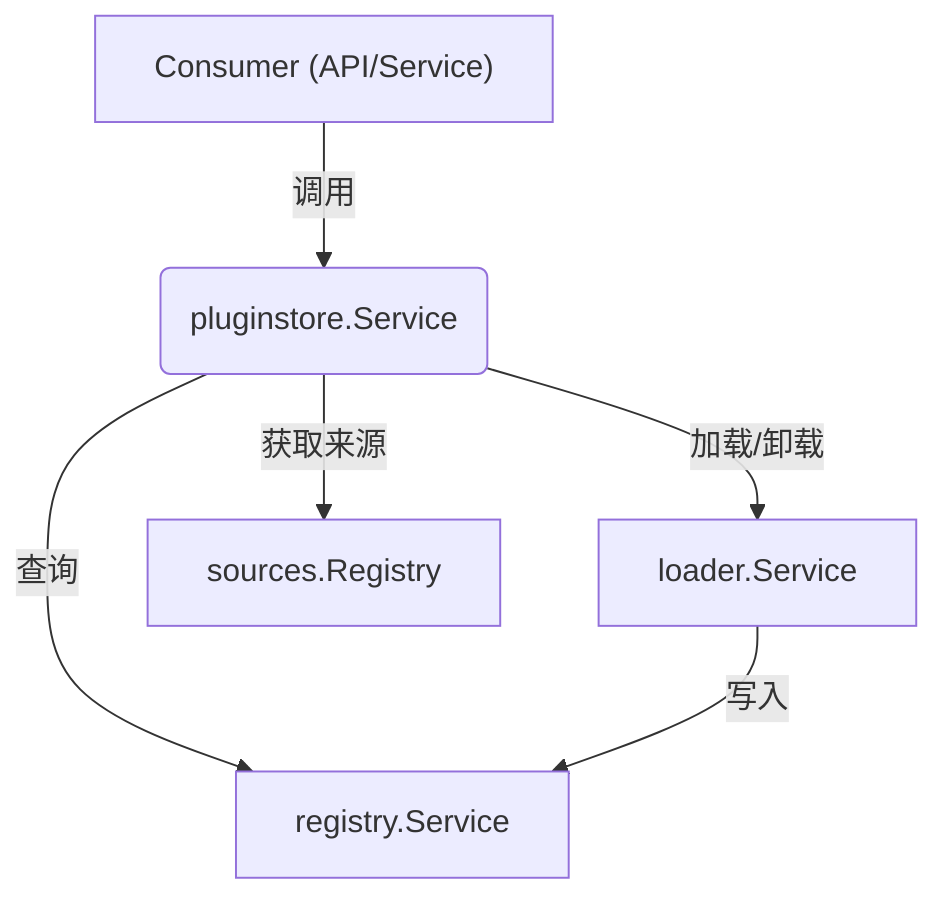

# Plugin Store Service (`pkg/services/pluginsintegration/pluginstore`)

## 概述

`pluginstore` 是 Grafana 插件子系统的**公共入口和外观模式 (Facade)** 实现。

虽然实际的插件加载逻辑在 `pkg/plugins/manager/loader`，存储逻辑在 `pkg/plugins/manager/registry`，但 `pluginstore` 负责将这些底层组件组合起来，为 Grafana 的其他部分（如 API Server, Background Services）提供统一的插件访问接口。

## 核心职责

1.  **生命周期管理**: 负责在 Grafana 启动时触发插件加载，并在关闭时协调插件卸载。
2.  **统一访问接口**: 提供 `Plugin()` 和 `Plugins()` 方法，供上层业务逻辑查询插件信息。
3.  **DTO 转换**: 将内部复杂的 `plugins.Plugin` 对象转换为对外的、更扁平的 `pluginstore.Plugin` 数据传输对象 (DTO)。
4.  **服务编排**: 协调 `Source` (来源) -> `Loader` (加载器) -> `Registry` (注册表) 的工作流。

## 关键组件

### 1. `Store` 接口 (`store.go`)
定义了外部消费者如何获取插件数据：
*   `Plugin(ctx, id)`: 获取单个插件详情。
*   `Plugins(ctx, types...)`: 获取插件列表，支持按类型过滤（如只获取 Datasource 类型的插件）。

### 2. `Service` 实现 (`store.go`)
这是 `Store` 接口的具体实现，同时也是一个后台服务 (`services.NamedService`)。

*   **启动流程 (`ProvideService` / `starting`)**:
    1.  从 `sources.Registry` 获取所有插件来源（如文件系统路径）。
    2.  调用 `pluginLoader.Load` 加载插件。
    3.  加载完成的插件会被注册到 `pluginRegistry`（由 Loader 内部处理）。
*   **查询流程**:
    *   所有查询请求最终都会委托给底层的 `pluginRegistry`。
*   **关闭流程 (`shutdown`)**:
    *   并行调用 `pluginLoader.Unload` 卸载所有插件，清理资源。

### 3. `Plugin` DTO (`plugins.go`)
为了解耦，`pluginstore` 定义了自己的 `Plugin` 结构体，而不是直接暴露底层的 `plugins.Plugin`。
*   **`ToGrafanaDTO`**: 负责将底层对象转换为 DTO。
*   负责处理一些通过计算得出的字段，例如 `SupportsStreaming` (检查插件 Client 是否支持 StreamHandler)。
*   处理父子插件关系的 ID 映射。

## 依赖关系

## 总结

如果你需要在 Grafana 的业务代码中获取插件信息（例如，“获取所有已安装的数据源插件”），你应该注入并使用 `pluginstore.Store` 接口，而不是直接去操作底层的 Registry 或 Loader。
