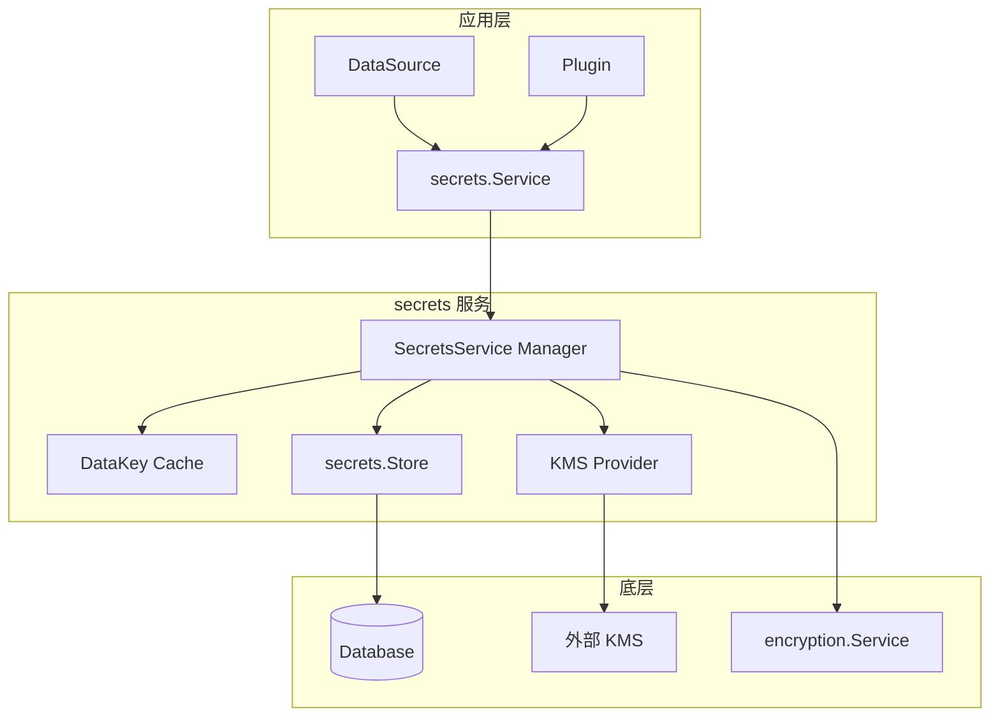
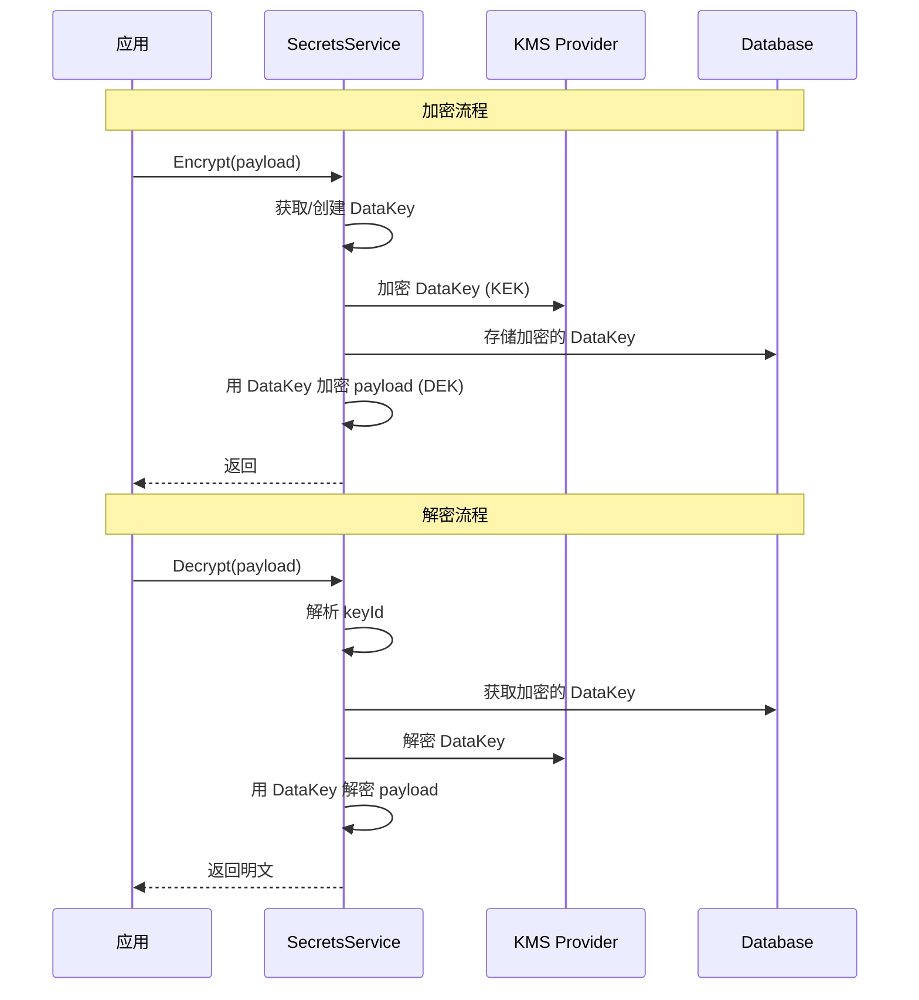
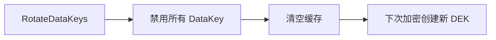

# Secrets Service

`pkg/services/secrets` 提供 Grafana 的**信封加密（Envelope Encryption）**服务，是对底层 `encryption.Service` 的高级封装。

> [!IMPORTANT]
> 所有需要加密存储的敏感数据都应使用此服务，而非直接使用 `encryption.Service`。

## 架构概览



## 信封加密原理



**关键概念：**
- **KEK (Key Encryption Key)**: KMS Provider 提供的主密钥
- **DEK (Data Encryption Key)**: 用于加密实际数据的 DataKey

## 核心接口 (`secrets.go`)

### Service 接口

```go
type Service interface {
    // 基础加解密
    Encrypt(ctx, payload []byte, opt EncryptionOptions) ([]byte, error)
    Decrypt(ctx, payload []byte) ([]byte, error)
    
    // JSON 数据加解密
    EncryptJsonData(ctx, kv map[string]string, opt) (map[string][]byte, error)
    DecryptJsonData(ctx, sjd map[string][]byte) (map[string]string, error)
    
    // 密钥轮换
    RotateDataKeys(ctx) error
    ReEncryptDataKeys(ctx) error
}
```

### 其他接口

| 接口 | 职责 |
|------|------|
| `Store` | DataKey 的 CRUD 操作 |
| `Provider` | KMS 提供商（加解密 DEK）|
| `Migrator` | 密钥迁移/回滚 |

## DataKey 模型 (`types.go`)

```go
type DataKey struct {
    Active        bool       // 是否激活
    Id            string     // 唯一标识
    Label         string     // 标签 (日期/scope@provider)
    Scope         string     // 作用域 (root, user:10, org:1)
    Provider      ProviderID // KMS Provider ID
    EncryptedData []byte     // 加密后的 DEK
}
```

### 加密选项

| 选项 | 用途 |
|------|------|
| `WithoutScope()` | 使用全局 DEK |
| `WithScope("user:10")` | 使用用户级 DEK |
| `WithScope("org:1")` | 使用组织级 DEK |

## Manager 实现 (`manager/`)

### SecretsService 结构

```go
type SecretsService struct {
    store             secrets.Store     // DataKey 存储
    enc               encryption.Internal // 底层加密
    providers         map[secrets.ProviderID]secrets.Provider
    currentProviderID secrets.ProviderID
    dataKeyCache      *dataKeyCache     // DEK 缓存
}
```

### 密文格式

```
#<base64(keyId)>#<encrypted_payload>
```

- `#` 分隔符标识信封加密
- 无前缀则回退到 legacy 加密

### 缓存策略

- **TTL**: 默认 15 分钟
- **谨慎期**: 新创建的 DEK 10 分钟内不cache by label
- **原因**: 避免 DB 事务未提交时缓存导致数据损坏

## KVStore (`kvstore/`)

基于 secrets 的加密键值存储：

```go
type SecretsKVStore interface {
    Get(ctx, orgId, namespace, typ) (string, bool, error)
    Set(ctx, orgId, namespace, typ, value) error
    Del(ctx, orgId, namespace, typ) error
    Keys(ctx, orgId, namespace, typ) ([]Key, error)
}
```

**用途：** 存储插件配置、OAuth Token 等敏感数据。

## 配置

### 默认加密设置

| 层级 | 默认值 | 说明 |
|------|--------|------|
| 底层加密算法 | `aes-cfb` | AES-CFB 对称加密 |
| KMS Provider | `secretKey.v1` | 使用配置文件中的 secret_key |
| 信封加密 | **启用** | 可通过 Feature Flag 禁用 |
| DEK 长度 | 16 字节 (128-bit) | 随机生成 |
| 密钥派生 | PBKDF2-SHA256 | 10,000 次迭代 |

### 配置项

```ini
[security]
# 主密钥，用于加密 DataKey（生产环境必须修改）
secret_key = SW2YcwTIb9zpOOhoPsMm

# KMS Provider（默认使用内置 secretKey）
encryption_provider = secretKey.v1

[security.encryption]
# 底层对称加密算法
algorithm = aes-cfb

# DataKey 缓存配置
data_keys_cache_ttl = 15m
data_keys_cache_cleanup_interval = 1m
```

### 可用 KMS Provider

| Provider ID | 类型 | 说明 |
|-------------|------|------|
| `secretKey.v1` | 内置 | 默认，使用 secret_key |
| `awskms.{keyId}` | AWS KMS | 外部托管 |
| `azurekv.{keyId}` | Azure Key Vault | 外部托管 |
| `gcpkms.{keyId}` | GCP KMS | 外部托管 |
| `hashivault.{keyId}` | HashiCorp Vault | 外部托管 |

> [!WARNING]
> 生产环境建议使用外部 KMS 替代默认的 `secretKey.v1`。

## 密钥轮换



## 文件结构

```
pkg/services/secrets/
├── secrets.go        # 接口定义
├── types.go          # DataKey 模型
├── manager/
│   ├── manager.go    # SecretsService 实现
│   ├── cache.go      # DataKey 缓存
│   └── metrics.go    # Prometheus 指标
├── kvstore/
│   ├── kvstore.go    # 加密 KV 存储接口
│   ├── sql.go        # SQL 实现
│   └── cache.go      # KV 缓存
├── database/         # 数据库迁移
├── migrator/         # 密钥迁移器
└── fakes/            # Mock 实现
```

## 与 encryption.Service 的关系

| 特性 | encryption.Service | secrets.Service |
|------|-------------------|-----------------|
| 定位 | 底层加密原语 | 企业级密钥管理 |
| 密钥管理 | 静态 secret_key | 动态 DataKey |
| 密钥轮换 | ❌ | ✅ |
| 多 KMS | ❌ | ✅ |
| Scope 隔离 | ❌ | ✅ |
