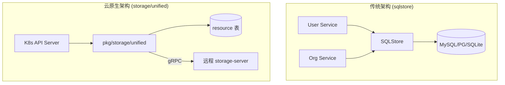
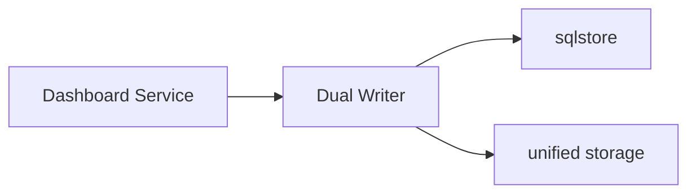
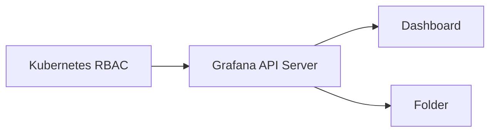

# Grafana 存储层

`pkg/storage` 和 `pkg/services/sqlstore` 是 Grafana 的两种存储抽象层，代表了从传统架构向云原生架构的演进。

## 架构对比



## pkg/services/sqlstore

**传统的关系型数据库访问层**，使用 xorm ORM 框架。

```go
type SQLStore struct {
    engine   *xorm.Engine     // xorm 引擎
    dialect  migrator.Dialect // SQL 方言
    dbCfg    *DatabaseConfig  // 数据库配置
}
```

**主要功能：**
- 数据库连接管理（SQLite/MySQL/PostgreSQL）
- 数据库迁移（migrations）
- 事务管理（WithTransactionalDbSession）
- 初始化默认用户/组织
- 连接池配置

## pkg/storage

**统一存储层**，支持 Kubernetes 风格的资源管理。

| 子包 | 作用 |
|------|------|
| `unified/` | K8s 风格资源存储，支持 gRPC 服务 |
| `legacysql/` | 传统 SQL 存储辅助函数 |
| `secret/` | 密钥加密存储 |

## 核心区别

### sqlstore 是 ORM 层

```go
// sqlstore 使用 xorm ORM，可操作任意表结构
type SQLStore struct {
    engine *xorm.Engine
}

// 典型用法 - 关系型查询
err := sess.Table("user").Where("id = ?", 1).Get(&user)
```

### unified 是资源存储

```go
// unified storage 使用固定的 K8s 资源模型
type Resource struct {
    Kind, Name, Namespace string
    Spec     []byte  // JSON
    Metadata map[string]string
}
```

### 对比表

| 特性 | **sqlstore** | **storage/unified** |
|------|--------------|---------------------|
| 本质 | **通用 ORM 层** | **K8s 资源存储** |
| 数据模型 | 任意表结构 | 固定 resource/history 表 |
| ORM | xorm | 原生 SQL + gRPC |
| API 风格 | 服务方法调用 | K8s CRUD (kubectl) |
| JOIN 查询 | ✅ | ❌ |
| 历史版本 | ❌ | ✅ 自动记录 |
| 分布式 | ❌ 单实例 | ✅ gRPC + 一致性哈希 |

### 能力矩阵

| 场景 | sqlstore | unified | 说明 |
|------|:--------:|:-------:|------|
| 用户、组织数据 | ✅ | ❌ | 关系型数据 |
| Dashboard/Folder | ✅ | ✅ | 正在迁移 |
| 自定义表结构 | ✅ | ❌ | unified 是固定模型 |
| K8s API 兼容 | ❌ | ✅ | kubectl 可用 |
| 版本历史 | ❌ | ✅ | 自动记录 |

> [!IMPORTANT]
> **两者不能互相替代！** sqlstore 用于关系型数据，unified 用于 K8s 风格资源。

## 双写迁移



**双写模式：**
| 模式 | 读取 | 写入 |
|------|------|------|
| 0 | 仅 Legacy | 仅 Legacy |
| 1-2 | 仅 Legacy | 两者 |
| 3 | Unified 优先 | 两者 |
| 4-5 | 仅 Unified | 仅 Unified |

## 演进方向

| 阶段 | 说明 |
|------|------|
| 当前 | 核心数据（用户、组织）仍使用 sqlstore |
| 迁移中 | Dashboard、Folder 通过双写迁移到 unified |
| 未来 | 所有资源使用 unified storage |

## 为什么需要 K8s 风格资源管理？

> 用户仍然可以通过 UI 创建 Dashboard，K8s 风格是额外提供的能力。

### 1. GitOps 和基础设施即代码

```yaml
# 用 Git 版本控制管理 Dashboard
apiVersion: dashboard.grafana.app/v1
kind: Dashboard
metadata:
  name: production-metrics
spec:
  title: "生产环境监控"
```

**场景：**
- CI/CD 自动同步 Dashboard 到所有环境
- 代码审查 Dashboard 变更
- 回滚就像 `git revert`

### 2. 批量管理和自动化

| 传统方式 | K8s 风格 |
|---------|---------|
| 一个个点击创建 | `kubectl apply -f dashboards/` |
| 手动导入 JSON | ArgoCD/Flux 自动同步 |
| 脚本调用 REST API | 声明式管理 |

### 3. 权限统一



- 使用 K8s 原生 RBAC 管理权限
- 与现有 K8s 权限体系集成
- 团队 namespace 隔离

### 4. 企业级场景

| 需求 | K8s 风格如何解决 |
|------|-----------------|
| 跨集群同步 | K8s Federation |
| 灾难恢复 | 声明式配置 + 版本控制 |
| 合规审计 | K8s 审计日志 |
| 模板化部署 | Helm Chart / Kustomize |

### 使用场景对比

| 场景 | 推荐方式 |
|------|---------|
| 个人快速探索 | UI 创建 |
| 团队协作 | Git + K8s 风格 |
| 生产环境部署 | CI/CD + K8s 风格 |
| 临时调试 | UI 创建 |

## 总结

- **sqlstore** = 传统 SQL 访问层，面向 Grafana 内部服务
- **storage/unified** = 云原生资源存储，支持 K8s API、gRPC、分布式部署

两者在迁移期间通过 **Dual Writer** 共存。
